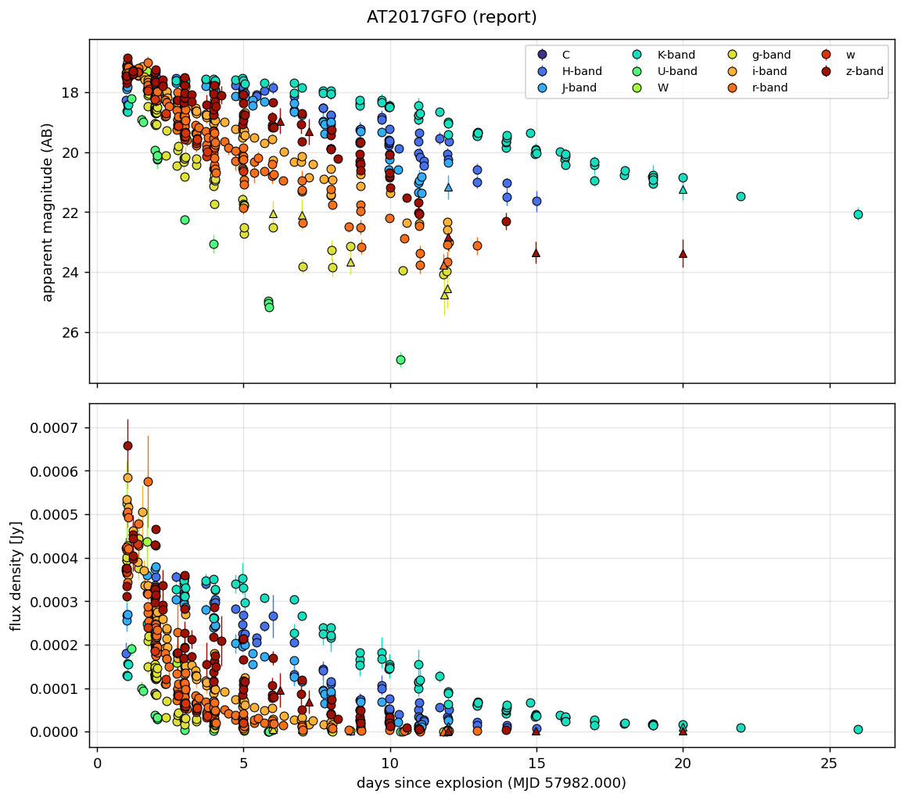

# Whisper (`whisper_labia`)

**Easy Bayesian model comparison of astronomical transient light curves.**

Give Whisper a light-curve CSV; it will tell you **which transient model best fits** and return the
**posteriors + model-selection metrics** (AIC, BIC, evidence, max-likelihood) for each model. It uses
[redback](https://github.com/nikhil-sarin/redback) for the physical *models* and *priors*; the data
handling, samplers, plots and outputs are Whisper's own — built to be **simple and extensible**.

> **Status:** early development. **Phase 1 — data ingestion + plotting — is done and tested
> (44 unit tests).** The samplers (MCMC, Dynesty, …) come next.

## Install

Whisper is `pip`-installable straight from GitHub. **Phase 1 (data ingestion + plotting) needs no
compiler and no redback** — it works in any container or venv:

```bash
pip install git+https://github.com/phelipedarc/WHISPER_AI.git
```

For **model fitting** (Phase 2+), add the `models` extra to pull redback (needs a C compiler for sncosmo):

```bash
pip install "whisper-labia[models] @ git+https://github.com/phelipedarc/WHISPER_AI.git"
```

**Develop / contribute** (editable install + tests):

```bash
git clone https://github.com/phelipedarc/WHISPER_AI.git
cd WHISPER_AI
pip install -e ".[dev]"
pytest -q
```

## 30-second quickstart

```python
import whisper_labia as wp

lc = wp.load_lightcurve("at2017gfo.csv")     # flexible CSV  ->  LightCurve
lc = lc.select_snr(min_snr=5)                # keep good detections (SNR >= 5)
wp.plot_light_curve(lc, layout="report")     # apparent-mag + flux overview, all bands
```



## What you can do today

- **Load** messy CSVs — auto-detects columns (time/mag/flux/err/band/system), comma or semicolon.
- **Group bands** — collapse heterogeneous filters (`B→g`, `V→r`, `Ks→K`, HST/JWST…) via `FILTER_LOOKUP`.
- **Quality-control** — drop bad rows, cut by **SNR** (`min_snr=3` or `5`), pick time windows / bands.
- **Convert & derive** — magnitude ↔ flux, per-point **SNR**, set the **explosion date** (day 0).
- **Plot** — a report (mag + flux) or a per-band grid (apparent / absolute mag, or flux), with clear
  marker conventions (detections = circles, SNR<3 = △, upper limits = ▽).
- **Fit** — **ABC** and **ABC-SMC** (parallel) with built-in models `flare`, `bazin`,
  `gaussian_rise` or your own (`register_model`); posteriors + AIC/BIC + JSON. See the
  [AT2017GFO model-comparison report](docs/REPORT_at2017gfo.md). Models *and* samplers are pluggable.

## Learn more

- 📘 **[Tutorial](docs/TUTORIAL.md)** — a hands-on tour of every feature, with plots.
- 📊 **[AT2017GFO report](docs/REPORT_at2017gfo.md)** — ABC vs ABC-SMC across three models.
- 🧩 **[Extending Whisper](docs/EXTENDING.md)** — add your own model, sampler, or distance.
- 📑 **[API reference](docs/API_REFERENCE.md)** — every function and its arguments.
- 📝 **[Changelog](CHANGELOG.md)**.

## License

GPLv3 (inherited from the redback dependency).
