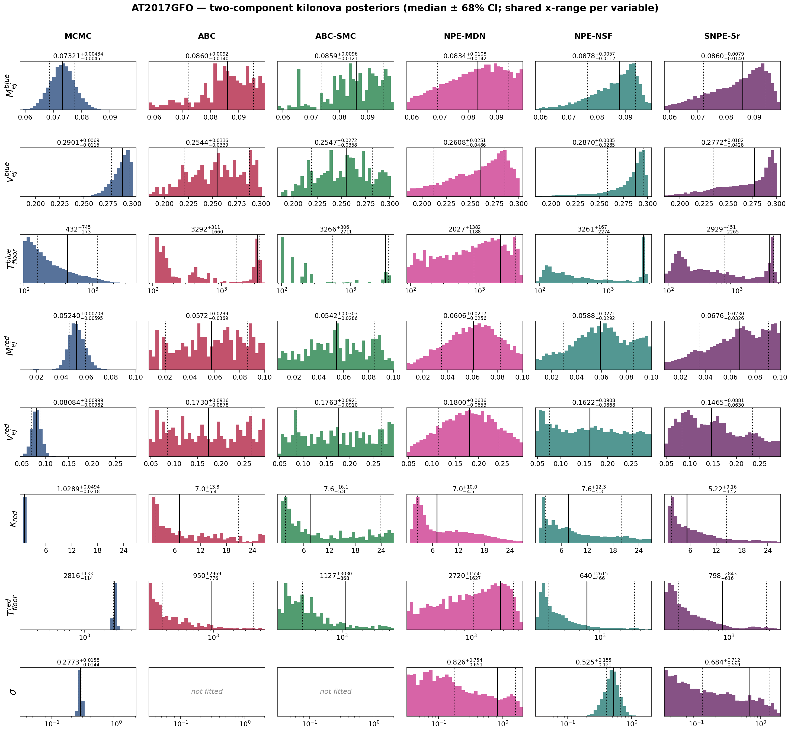
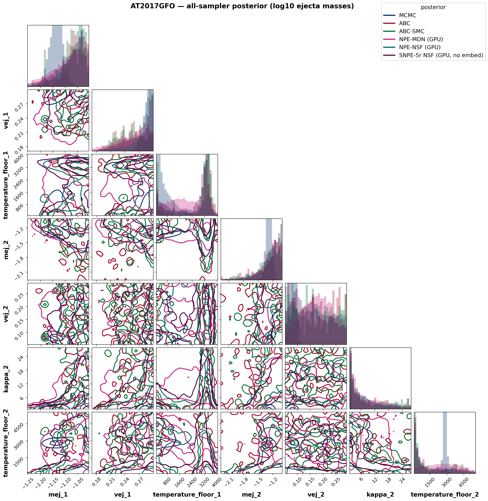
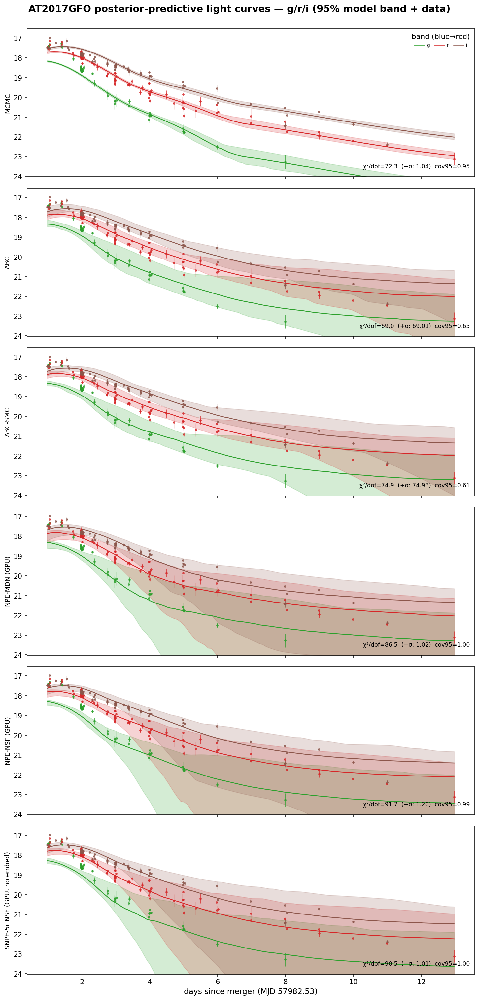
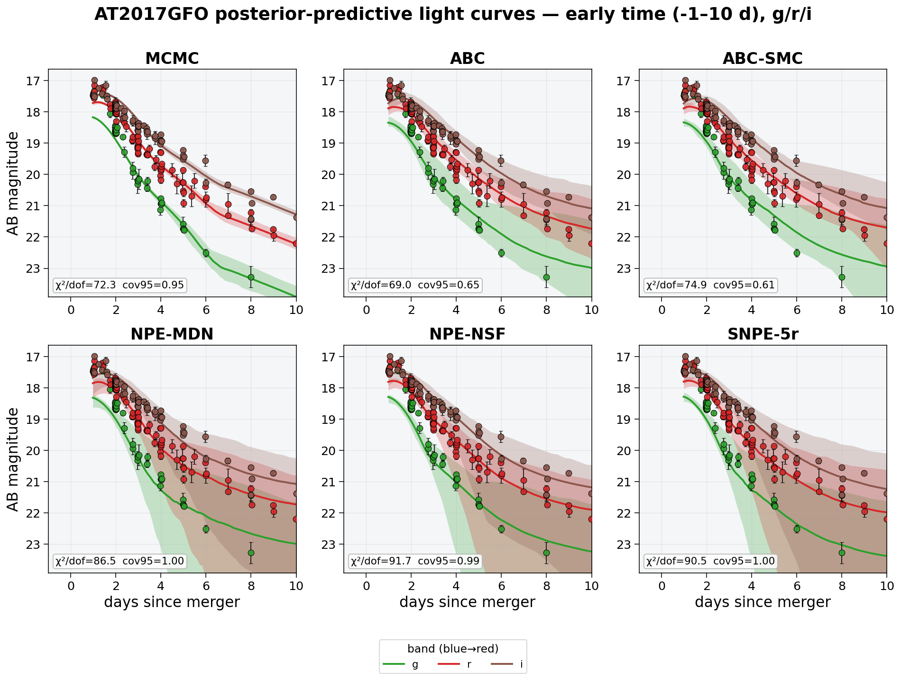
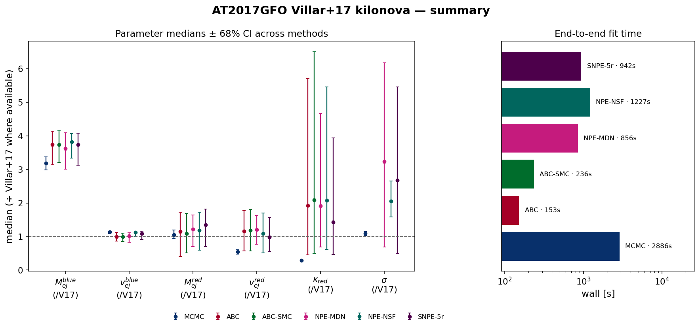

# AT2017GFO — Villar+2017-style two-component kilonova with WHISPER

Real-data application: the redback `two_component_kilonova` model with **κ_blue = 0.5 cm²/g fixed**, redshift fixed (z = 0.00984), **κ_red and both temperature floors free**, fit to the AT2017GFO g/r/i photometry (SNR ≥ 3) in **apparent-magnitude space** (Villar+17; σ ≈ fractional-flux scatter [mag]). The likelihood-based and neural methods also fit the **Villar+17 extra-scatter term σ** (added in quadrature to the reported errors):

$$\ln\mathcal{L} = -\tfrac{1}{2}\sum_i\left[\frac{(O_i-M_i)^2}{\sigma_i^2+\sigma^2} + \ln\big(2\pi(\sigma_i^2+\sigma^2)\big)\right]$$

*(the correctly normalized form of Villar et al. 2017, Eq. 4, as implemented in MOSFiT). The distance-based ABC family fits the 7 physical parameters only: a χ² rejection distance is monotonically penalised by extra simulation noise, so a noise-level parameter is not identifiable by distance-based ABC — verified on synthetic data.*

## Posterior medians ± 68% CI

| parameter | MCMC | ABC | ABC-SMC | NPE-MDN (GPU) | NPE-NSF (GPU) | SNPE-5r NSF (GPU, no embed) |
|---|---|---|---|---|---|---|
| M_{ej}^{blue} | 0.07321 [+0.0043 −0.0045] | 0.08603 [+0.0092 −0.014] | 0.08589 [+0.0096 −0.012] | 0.08338 [+0.011 −0.014] | 0.08778 [+0.0057 −0.011] | 0.08596 [+0.0079 −0.014] |
| v_{ej}^{blue} | 0.2901 [+0.0069 −0.012] | 0.2544 [+0.034 −0.034] | 0.2547 [+0.027 −0.036] | 0.2608 [+0.025 −0.049] | 0.287 [+0.0085 −0.028] | 0.2772 [+0.018 −0.043] |
| T_{floor}^{blue} | 432.3 [+7.4e+02 −2.7e+02] | 3292 [+3.1e+02 −1.7e+03] | 3266 [+3.1e+02 −2.7e+03] | 2027 [+1.4e+03 −1.2e+03] | 3261 [+1.7e+02 −2.3e+03] | 2929 [+4.5e+02 −2.3e+03] |
| M_{ej}^{red} | 0.0524 [+0.0071 −0.006] | 0.05721 [+0.029 −0.037] | 0.05421 [+0.03 −0.029] | 0.0606 [+0.022 −0.026] | 0.05883 [+0.027 −0.029] | 0.06762 [+0.023 −0.033] |
| v_{ej}^{red} | 0.08084 [+0.01 −0.0098] | 0.173 [+0.092 −0.088] | 0.1763 [+0.092 −0.091] | 0.18 [+0.064 −0.065] | 0.1622 [+0.091 −0.087] | 0.1465 [+0.088 −0.063] |
| \kappa_{red} | 1.029 [+0.049 −0.022] | 7.038 [+14 −5.4] | 7.633 [+16 −5.8] | 6.985 [+10 −4.5] | 7.58 [+12 −5.3] | 5.218 [+9.2 −3.5] |
| T_{floor}^{red} | 2816 [+1.3e+02 −1.1e+02] | 949.6 [+3e+03 −7.8e+02] | 1127 [+3e+03 −8.7e+02] | 2720 [+1.6e+03 −1.6e+03] | 640.2 [+2.6e+03 −4.7e+02] | 797.8 [+2.8e+03 −6.2e+02] |
| \sigma | 0.2773 [+0.016 −0.014] | — | — | 0.8263 [+0.75 −0.65] | 0.5255 [+0.16 −0.12] | 0.6841 [+0.71 −0.56] |

*Reference — **Villar et al. 2017 (ApJL 851 L21), Table 2, 2-component fit** (κ_blue = 0.5 fixed, matching this setup): M_ej^blue = 0.023 M☉, v^blue = 0.256 c, T^blue = 3983 K, M_ej^red = 0.050 M☉, v^red = 0.149 c, κ_red = 3.65 cm²/g, T^red = 1151 K, σ = 0.256 mag (WAIC = −1030). Villar+17 fit a much larger UV–optical–NIR dataset with a radiative-transfer-calibrated model, so the absolute values are a literature anchor, not ground truth. The medians ÷ Villar+17 are compared in the summary figure below.*

## Goodness-of-fit & cost

| method | χ²/dof (reported σᵢ) | χ²/dof (σᵢ ⊕ σ) | PPC cov95 | wall [s] | per-object [s] | AIC |
|---|---|---|---|---|---|---|
| MCMC | 72.3 | 1.04 | 0.95 | 2886 | 2886 | 89 |
| ABC | 69.0 | 69.01 | 0.65 | 153 | 153 | 13241 |
| ABC-SMC | 74.9 | 74.93 | 0.61 | 236 | 236 | 14449 |
| NPE-MDN (GPU) | 86.5 | 1.02 | 1.00 | 856 | 0.01 | 152 |
| NPE-NSF (GPU) | 91.7 | 1.20 | 0.99 | 1227 | 0.07 | 146 |
| SNPE-5r NSF (GPU, no embed) | 90.5 | 1.01 | 1.00 | 942 | 942 | 139 |

*χ²/dof against the reported errors is ≫1 for every method — high-SNR kilonova photometry always carries model systematics beyond the measurement errors; that is exactly what σ absorbs: with the fitted scatter the χ²/dof (σᵢ ⊕ σ) is ≈1 and the predictive coverage is nominal. AIC values are comparable only among methods fitting the same parameter set (the ABC family omits σ).*

## Interpretation

- **The scatter term works.** MCMC recovers an extra scatter **σ ≈ 0.28 mag**, in the ballpark of **Villar+2017's σ = 0.256 mag** (the neural σ posteriors run broader — a single light curve weakly constrains a noise level). Folding it in quadrature turns the χ²/dof (vs reported errors) into ≈1 with nominal 95% predictive coverage — the excess is model systematics (a semi-analytic two-component kilonova can't capture every spectral feature), exactly what Villar+17 introduced σ to absorb.
- **Blue component.** With κ_blue fixed at 0.5 the blue component is well-specified in regime; MCMC gives v_ej^blue ≈ 0.29 c — pushed to the fast edge of the physical prior (the optical decline wants fast blue ejecta; the degeneracy only fully breaks with NIR).
- **Red component — still edge-limited.** κ_red is *free* and the red ejecta radiate mostly in the **NIR**, which this band set constrains weakly — so kappa_2 rail against their prior edges. Adding NIR coverage (the full-UVOIR run) is what identifies them.
- **Early-time peak timing.** In **i-band**, MCMC's best-fit curve peaks at t≈1.49 d — **+0.44 d** from the brightest *observed* point (t≈1.05 d) — even though the aggregate χ²/dof and coverage look good (visible in the zoomed early-time PPC below, not the aggregate metrics: a handful of near-peak points are outweighed by the many post-peak points in the χ² sum, and the fitted scatter σ absorbs the residual). Present in **both magnitude and flux space** at similar magnitude, so it is not a units/weighting artifact — most plausibly the semi-analytic two-component model's single-diffusion-timescale-per-component approximation not capturing the very early (<1 d) rise/peak shape as precisely as a full radiative-transfer calculation.
- **MCMC vs simulation-based inference.** MCMC finds the sharp maximum-likelihood mode (χ²/dof = 72 vs reported errors, lowest AIC); the amortized/rejection samplers report a broader posterior bulk. They agree on the well-constrained quantities (blue ejecta, σ) and diverge where the data are least informative — the honest signature of a real-data fit.
- **Amortized inference.** Once trained, NPE conditions a *new* AT2017GFO-like light curve in ~10–80 ms (the per-object column) versus a full refit for MCMC — the payoff of neural SBI when many objects share one model.

## Figures

### Posterior histograms

Per-parameter marginal posteriors (rows) for every method (columns), each annotated with its median ± 68% CI; each variable shares one x-range across methods for direct comparison. σ is *not fitted* by the distance-based ABC family.

### Corner plot

Joint posteriors of all fitted parameters (ejecta masses shown as log₁₀), every method overlaid. The neural and ABC methods overlap in a broad central region while MCMC (dark blue) sits apart in its sharp, prior-edge MAP — the mode tension made visual, including the parameter correlations (e.g. M_ej^red–v_ej^red, κ_red–T_floor^red).

### Posterior-predictive light curves

Each method's 95% posterior-predictive model band in g/r/i (coloured) over the AT2017GFO photometry, with the per-panel χ²/dof (vs reported errors and vs errors ⊕ σ) and 95% coverage. MCMC gives the tightest, best-tracking band; the neural methods carry wider bands reflecting the marginal σ uncertainty.

### Posterior-predictive light curves — early time (zoom)

The same posterior-predictive check, zoomed to the first 10 days (where the two components pull apart fastest) and laid out as one square panel per method for a closer read of the band-by-band structure.

### Summary — medians & runtime

Parameter medians ± 68% CI across methods, each normalised to the Villar+2017 value where available (dashed line = Villar+17), and the end-to-end wall time per method.

