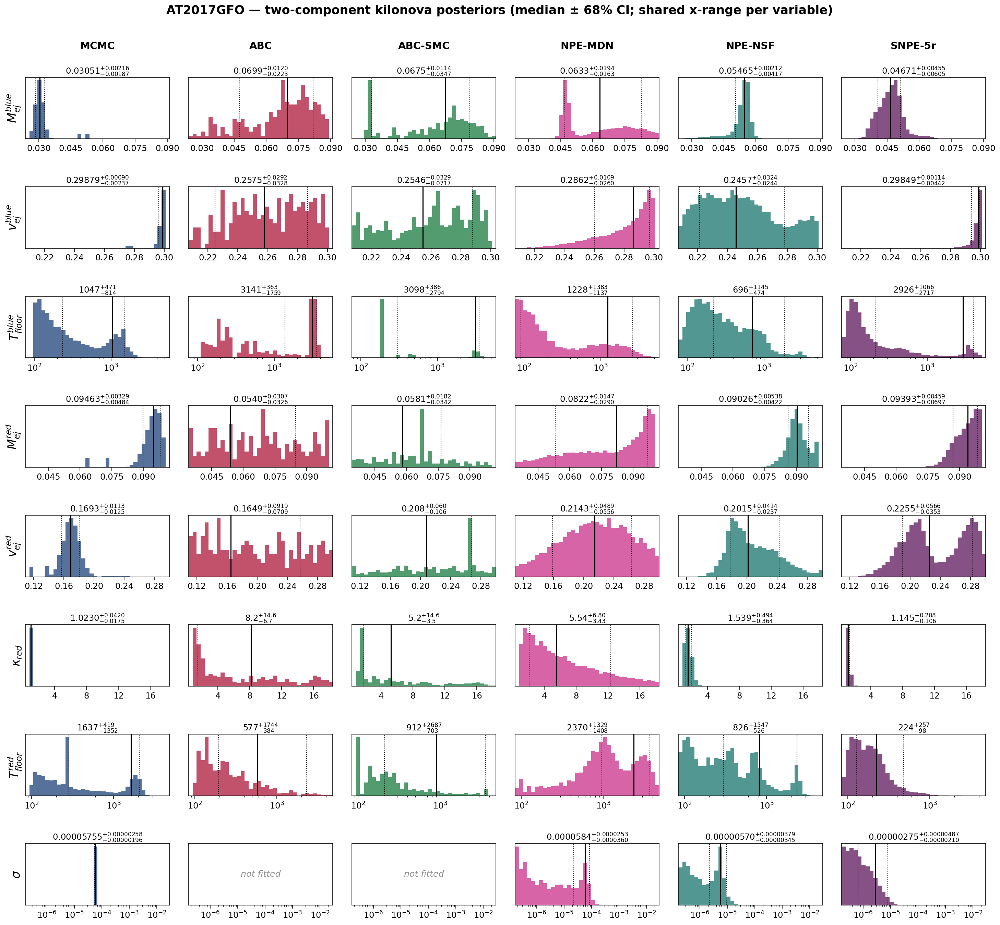
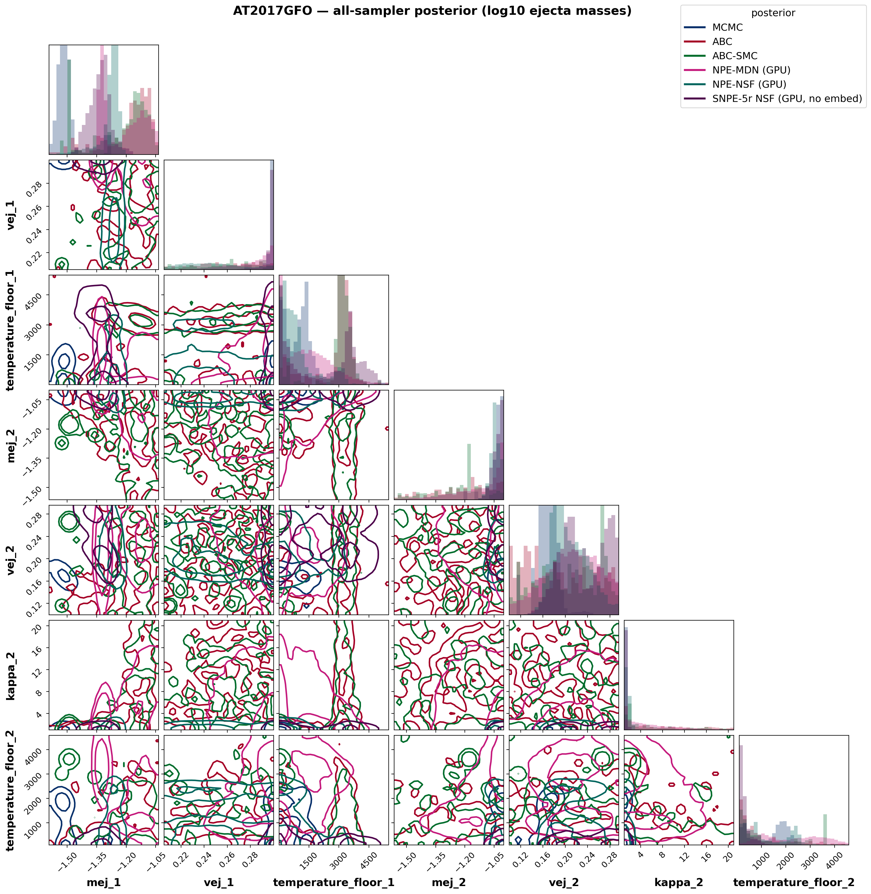
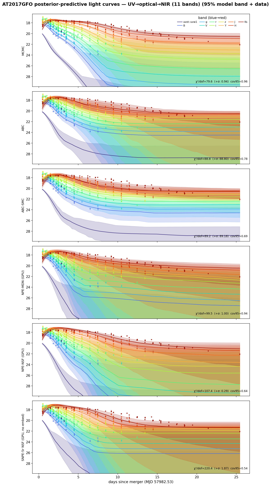
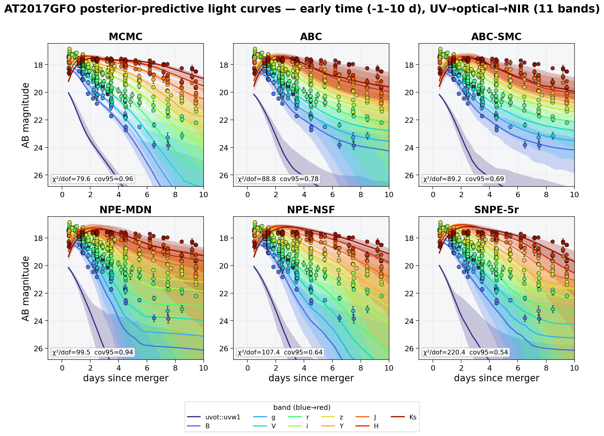
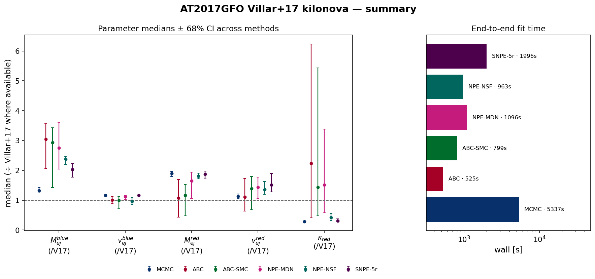

# AT2017GFO — Villar+2017-style two-component kilonova with WHISPER (full UVOIR, flux space)

Real-data application: the redback `two_component_kilonova` model with **κ_blue = 0.5 cm²/g fixed**, redshift fixed (z = 0.00984), **κ_red and both temperature floors free**, fit to the AT2017GFO **full UV → optical → NIR photometry** (11 bands, Swift-UV `uvw1` through 2MASS `Ks`, SNR ≥ 3, 0–30 d) in **flux space** (additive-flux scatter σ [Jy]). The likelihood-based and neural methods also fit the **Villar+17 extra-scatter term σ** (added in quadrature to the reported errors):

$$\ln\mathcal{L} = -\tfrac{1}{2}\sum_i\left[\frac{(O_i-M_i)^2}{\sigma_i^2+\sigma^2} + \ln\big(2\pi(\sigma_i^2+\sigma^2)\big)\right]$$

*(the correctly normalized form of Villar et al. 2017, Eq. 4, as implemented in MOSFiT). The distance-based ABC family fits the 7 physical parameters only: a χ² rejection distance is monotonically penalised by extra simulation noise, so a noise-level parameter is not identifiable by distance-based ABC — verified on synthetic data.*

## Posterior medians ± 68% CI

| parameter | MCMC | ABC | ABC-SMC | NPE-MDN (GPU) | NPE-NSF (GPU) | SNPE-5r NSF (GPU, no embed) |
|---|---|---|---|---|---|---|
| M_{ej}^{blue} | 0.03051 [+0.0022 −0.0019] | 0.06991 [+0.012 −0.022] | 0.06749 [+0.011 −0.035] | 0.0633 [+0.019 −0.016] | 0.05465 [+0.0021 −0.0042] | 0.04671 [+0.0046 −0.006] |
| v_{ej}^{blue} | 0.2988 [+0.0009 −0.0024] | 0.2575 [+0.029 −0.033] | 0.2546 [+0.033 −0.072] | 0.2862 [+0.011 −0.026] | 0.2457 [+0.032 −0.024] | 0.2985 [+0.0011 −0.0044] |
| T_{floor}^{blue} | 1047 [+4.7e+02 −8.1e+02] | 3141 [+3.6e+02 −1.8e+03] | 3098 [+3.9e+02 −2.8e+03] | 1228 [+1.4e+03 −1.1e+03] | 696.4 [+1.1e+03 −4.7e+02] | 2926 [+1.1e+03 −2.7e+03] |
| M_{ej}^{red} | 0.09463 [+0.0033 −0.0048] | 0.05398 [+0.031 −0.033] | 0.05814 [+0.018 −0.034] | 0.0822 [+0.015 −0.029] | 0.09026 [+0.0054 −0.0042] | 0.09393 [+0.0046 −0.007] |
| v_{ej}^{red} | 0.1693 [+0.011 −0.012] | 0.1649 [+0.092 −0.071] | 0.2076 [+0.06 −0.11] | 0.2143 [+0.049 −0.056] | 0.2015 [+0.041 −0.024] | 0.2255 [+0.057 −0.035] |
| \kappa_{red} | 1.023 [+0.042 −0.017] | 8.171 [+15 −6.7] | 5.217 [+15 −3.5] | 5.54 [+6.8 −3.4] | 1.539 [+0.49 −0.36] | 1.145 [+0.21 −0.11] |
| T_{floor}^{red} | 1637 [+4.2e+02 −1.4e+03] | 577.2 [+1.7e+03 −3.8e+02] | 912 [+2.7e+03 −7e+02] | 2370 [+1.3e+03 −1.4e+03] | 825.7 [+1.5e+03 −5.3e+02] | 223.9 [+2.6e+02 −98] |
| \sigma | 5.755e-05 [+2.6e-06 −2e-06] | — | — | 5.841e-05 [+2.5e-05 −3.6e-05] | 5.695e-06 [+3.8e-06 −3.4e-06] | 2.75e-06 [+4.9e-06 −2.1e-06] |

*Reference — **Villar et al. 2017 (ApJL 851 L21), Table 2, 2-component fit** (κ_blue = 0.5 fixed, matching this setup): M_ej^blue = 0.023 M☉, v^blue = 0.256 c, T^blue = 3983 K, M_ej^red = 0.050 M☉, v^red = 0.149 c, κ_red = 3.65 cm²/g, T^red = 1151 K, σ = 0.256 mag (WAIC = −1030). Villar+17 fit a much larger UV–optical–NIR dataset with a radiative-transfer-calibrated model, so the absolute values are a literature anchor, not ground truth. The medians ÷ Villar+17 are compared in the summary figure below.*

## Goodness-of-fit & cost

| method | χ²/dof (reported σᵢ) | χ²/dof (σᵢ ⊕ σ) | PPC cov95 | wall [s] | per-object [s] | AIC |
|---|---|---|---|---|---|---|
| MCMC | 79.6 | 0.94 | 0.96 | 5337 | 5337 | -8300 |
| ABC | 88.8 | 88.80 | 0.78 | 525 | 525 | 32589 |
| ABC-SMC | 89.2 | 89.18 | 0.69 | 799 | 799 | 32778 |
| NPE-MDN (GPU) | 99.5 | 1.00 | 0.94 | 1096 | 1096 | -8206 |
| NPE-NSF (GPU) | 107.4 | 0.29 | 0.64 | 963 | 963 | -7835 |
| SNPE-5r NSF (GPU, no embed) | 220.4 | 1.87 | 0.54 | 1996 | 1996 | -7803 |

*χ²/dof against the reported errors is ≫1 for every method — high-SNR kilonova photometry always carries model systematics beyond the measurement errors; that is exactly what σ absorbs: with the fitted scatter the χ²/dof (σᵢ ⊕ σ) is ≈1 and the predictive coverage is nominal. AIC values are comparable only among methods fitting the same parameter set (the ABC family omits σ).*

## Interpretation

- **The scatter term works.** MCMC recovers a flux-space extra scatter **σ ≈ 5.8e-05 Jy** (∼ the per-point flux errors); the neural σ posteriors are broader (a single light curve weakly constrains a noise level). Folding it in quadrature turns the χ²/dof (vs reported errors) into ≈1 with nominal 95% predictive coverage — the excess is model systematics (a semi-analytic two-component kilonova can't capture every spectral feature), exactly what Villar+17 introduced σ to absorb.
- **Blue component.** With κ_blue fixed at 0.5 the blue component is well-specified in regime; MCMC gives v_ej^blue ≈ 0.30 c — pushed to the fast edge of the physical prior (the optical decline wants fast blue ejecta; the degeneracy only fully breaks with NIR).
- **Red component — still edge-limited.** κ_red is *free* and the red ejecta radiate mostly in the **NIR**, which this band set constrains weakly — so kappa_2 rail against their prior edges. Adding NIR coverage (the full-UVOIR run) is what identifies them.
- **Early-time peak timing.** In **i-band**, MCMC's best-fit curve peaks at t≈1.08 d — **+0.56 d** from the brightest *observed* point (t≈0.52 d) — even though the aggregate χ²/dof and coverage look good (visible in the zoomed early-time PPC below, not the aggregate metrics: a handful of near-peak points are outweighed by the many post-peak points in the χ² sum, and the fitted scatter σ absorbs the residual). Present in **both magnitude and flux space** at similar magnitude, so it is not a units/weighting artifact — most plausibly the semi-analytic two-component model's single-diffusion-timescale-per-component approximation not capturing the very early (<1 d) rise/peak shape as precisely as a full radiative-transfer calculation.
- **MCMC vs simulation-based inference.** MCMC finds the sharp maximum-likelihood mode (χ²/dof = 80 vs reported errors, lowest AIC); the amortized/rejection samplers report a broader posterior bulk. They agree on the well-constrained quantities (blue ejecta, σ) and diverge where the data are least informative — the honest signature of a real-data fit.
- **Amortized inference.** Once trained, NPE conditions a *new* AT2017GFO-like light curve in ~10–80 ms (the per-object column) versus a full refit for MCMC — the payoff of neural SBI when many objects share one model.

## Figures

### Posterior histograms

Per-parameter marginal posteriors (rows) for every method (columns), each annotated with its median ± 68% CI; each variable shares one x-range across methods for direct comparison. σ is *not fitted* by the distance-based ABC family.

### Corner plot

Joint posteriors of all fitted parameters (ejecta masses shown as log₁₀), every method overlaid. The neural and ABC methods overlap in a broad central region while MCMC (dark blue) sits apart in its sharp, prior-edge MAP — the mode tension made visual, including the parameter correlations (e.g. M_ej^red–v_ej^red, κ_red–T_floor^red).

### Posterior-predictive light curves

Each method's 95% posterior-predictive model band in g/r/i (coloured) over the AT2017GFO photometry, with the per-panel χ²/dof (vs reported errors and vs errors ⊕ σ) and 95% coverage. MCMC gives the tightest, best-tracking band; the neural methods carry wider bands reflecting the marginal σ uncertainty.

### Posterior-predictive light curves — early time (zoom)

The same posterior-predictive check, zoomed to the first 10 days (where the two components pull apart fastest) and laid out as one square panel per method for a closer read of the band-by-band structure.

### Summary — medians & runtime

Parameter medians ± 68% CI across methods, each normalised to the Villar+2017 value where available (dashed line = Villar+17), and the end-to-end wall time per method.

