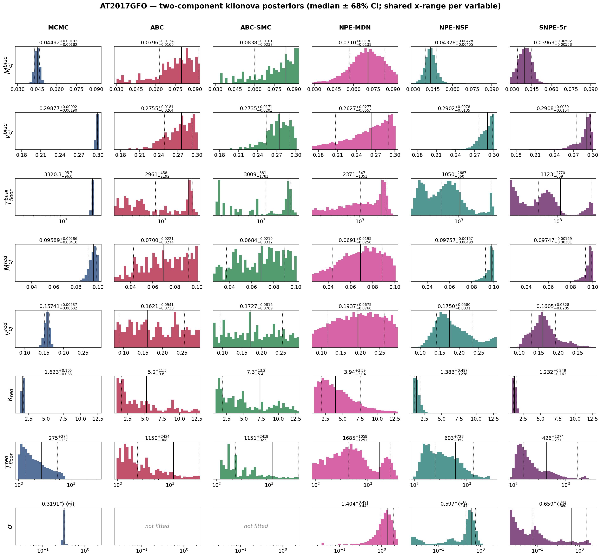
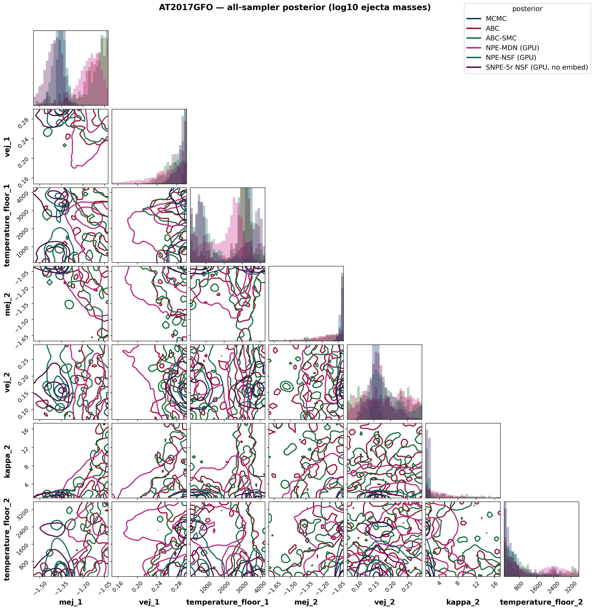
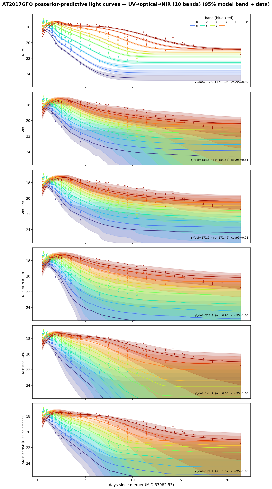
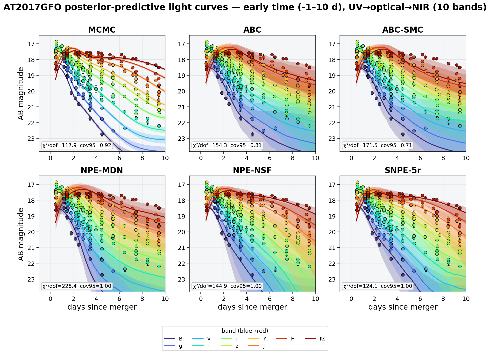
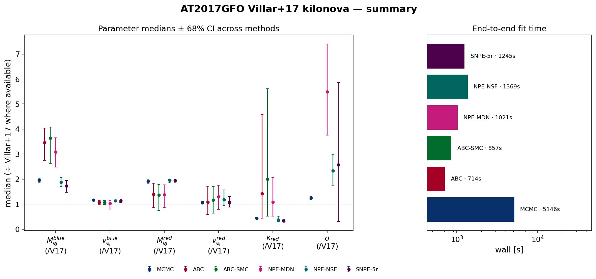

# AT2017GFO — Villar+2017-style two-component kilonova with WHISPER (preprocessed UVOIR)

Real-data application: the redback `two_component_kilonova` model with **κ_blue = 0.5 cm²/g fixed**, redshift fixed (z = 0.00984), **κ_red and both temperature floors free**, fit to the AT2017GFO **preprocessed UV → optical → NIR photometry** (10 bands, Swift-UVOT `uvw1` dropped, SNR > 5, one observation per band per 0.01 d epoch, 0–30 d) in **apparent-magnitude space** (Villar+17; σ ≈ fractional-flux scatter [mag]). The likelihood-based and neural methods also fit the **Villar+17 extra-scatter term σ** (added in quadrature to the reported errors):

$$\ln\mathcal{L} = -\tfrac{1}{2}\sum_i\left[\frac{(O_i-M_i)^2}{\sigma_i^2+\sigma^2} + \ln\big(2\pi(\sigma_i^2+\sigma^2)\big)\right]$$

*(the correctly normalized form of Villar et al. 2017, Eq. 4, as implemented in MOSFiT). The distance-based ABC family fits the 7 physical parameters only: a χ² rejection distance is monotonically penalised by extra simulation noise, so a noise-level parameter is not identifiable by distance-based ABC — verified on synthetic data.*

## Posterior medians ± 68% CI

| parameter | MCMC | ABC | ABC-SMC | NPE-MDN (GPU) | NPE-NSF (GPU) | SNPE-5r NSF (GPU, no embed) |
|---|---|---|---|---|---|---|
| M_{ej}^{blue} | 0.04492 [+0.0019 −0.0018] | 0.07957 [+0.013 −0.017] | 0.08377 [+0.01 −0.024] | 0.07095 [+0.013 −0.014] | 0.04328 [+0.0043 −0.0041] | 0.03963 [+0.005 −0.0056] |
| v_{ej}^{blue} | 0.2988 [+0.00092 −0.0019] | 0.2755 [+0.018 −0.026] | 0.2735 [+0.017 −0.02] | 0.2627 [+0.028 −0.056] | 0.2902 [+0.0078 −0.014] | 0.2908 [+0.0059 −0.016] |
| T_{floor}^{blue} | 3320 [+96 −96] | 2961 [+4.6e+02 −2.2e+03] | 3009 [+3.8e+02 −1.8e+03] | 2371 [+5.5e+02 −1.4e+03] | 1050 [+2.7e+03 −5.6e+02] | 1123 [+2.8e+03 −6.7e+02] |
| M_{ej}^{red} | 0.09589 [+0.0029 −0.0042] | 0.06998 [+0.022 −0.027] | 0.06844 [+0.021 −0.031] | 0.0691 [+0.02 −0.026] | 0.09757 [+0.0016 −0.005] | 0.09747 [+0.0017 −0.0038] |
| v_{ej}^{red} | 0.1574 [+0.0059 −0.0068] | 0.1621 [+0.094 −0.074] | 0.1727 [+0.082 −0.077] | 0.1937 [+0.067 −0.077] | 0.175 [+0.058 −0.033] | 0.1605 [+0.033 −0.028] |
| \kappa_{red} | 1.623 [+0.11 −0.088] | 5.184 [+12 −3.6] | 7.317 [+13 −5.4] | 3.943 [+3.6 −2] | 1.383 [+0.5 −0.28] | 1.232 [+0.25 −0.16] |
| T_{floor}^{red} | 274.9 [+2.7e+02 −1.4e+02] | 1150 [+2.4e+03 −9.1e+02] | 1151 [+2.5e+03 −9.2e+02] | 1685 [+1.1e+03 −1.3e+03] | 602.6 [+7.3e+02 −3.5e+02] | 425.5 [+1.3e+03 −2.7e+02] |
| \sigma | 0.3191 [+0.013 −0.013] | — | — | 1.404 [+0.49 −0.44] | 0.5971 [+0.17 −0.15] | 0.6591 [+0.84 −0.58] |

*Reference — **Villar et al. 2017 (ApJL 851 L21), Table 2, 2-component fit** (κ_blue = 0.5 fixed, matching this setup): M_ej^blue = 0.023 M☉, v^blue = 0.256 c, T^blue = 3983 K, M_ej^red = 0.050 M☉, v^red = 0.149 c, κ_red = 3.65 cm²/g, T^red = 1151 K, σ = 0.256 mag (WAIC = −1030). Villar+17 fit a much larger UV–optical–NIR dataset with a radiative-transfer-calibrated model, so the absolute values are a literature anchor, not ground truth. The medians ÷ Villar+17 are compared in the summary figure below.*

## Goodness-of-fit & cost

| method | χ²/dof (reported σᵢ) | χ²/dof (σᵢ ⊕ σ) | PPC cov95 | wall [s] | per-object [s] | AIC |
|---|---|---|---|---|---|---|
| MCMC | 117.9 | 1.05 | 0.92 | 5146 | 5146 | 221 |
| ABC | 154.3 | 154.34 | 0.81 | 714 | 714 | 50048 |
| ABC-SMC | 171.5 | 171.45 | 0.71 | 857 | 857 | 55747 |
| NPE-MDN (GPU) | 228.4 | 0.90 | 1.00 | 1021 | 0.16 | 482 |
| NPE-NSF (GPU) | 144.9 | 0.88 | 1.00 | 1369 | 0.21 | 264 |
| SNPE-5r NSF (GPU, no embed) | 124.1 | 1.57 | 1.00 | 1245 | 1245 | 266 |

*χ²/dof against the reported errors is ≫1 for every method — high-SNR kilonova photometry always carries model systematics beyond the measurement errors; that is exactly what σ absorbs: with the fitted scatter the χ²/dof (σᵢ ⊕ σ) is ≈1 and the predictive coverage is nominal. AIC values are comparable only among methods fitting the same parameter set (the ABC family omits σ).*

## Posterior-predictive metrics

Computed from the posterior samples via `whisper_labia.predictive_metrics` — **scatter-aware**: the log-predictive density (LPD), WAIC, PSIS-LOO and coverage use the fit's own noise model, `𝒩(Mᵢ, σᵢ² + σ²)` with each draw's fitted scatter σ (Villar+17; Vehtari, Gelman & Gabry 2017). Distance-based ABC fits no σ, so it falls back to the reported errors (flagged below).

| method | RMSE [mag] ↓ | LPD ↑ | ELPD-LOO ↑ (p_loo, k) | WAIC ↓ | cov68 | cov95 | σ-aware |
|---|---|---|---|---|---|---|---|
| MCMC | 0.329 | -104 | -109 (5, 0.46) | 218 | 0.72 | 0.92 | σ |
| ABC | 0.449 | -8897 | -128043 (119146, inf) | 17185077 | 0.43 | 0.81 | no |
| ABC-SMC | 0.473 | -11741 | -113202 (101461, inf) | 14758308 | 0.38 | 0.71 | no |
| NPE-MDN (GPU) | 0.545 | -456 | -852 (396, 5.96) | 2245 | 1.00 | 1.00 | σ |
| NPE-NSF (GPU) | 0.583 | -242 | -8551 (8309, inf) | 159586 | 0.89 | 1.00 | σ |
| SNPE-5r NSF (GPU, no embed) | 0.412 | -223 | -41947 (41725, inf) | 2569807 | 0.95 | 1.00 | σ |

*RMSE is against the posterior-mean prediction. LPD/WAIC/ELPD-LOO are on the log-predictive scale (LPD & ELPD higher = better; WAIC lower = better). PSIS-LOO's Pareto-k > 0.7 (or ∞) flags an unreliable LOO estimate — common for the heavier-tailed neural/ABC importance weights, where WAIC and coverage are the better guides. Coverage ≈ nominal ⇒ calibrated; see the calibration figure. The ABC family (no σ) shows the collapse that a scatter-agnostic predictive produces — an honest signature that its distance posterior is not a calibrated predictive here.*

## Interpretation

- **The scatter term works.** MCMC recovers an extra scatter **σ ≈ 0.32 mag**, in the ballpark of **Villar+2017's σ = 0.256 mag** (the neural σ posteriors run broader — a single light curve weakly constrains a noise level). Folding it in quadrature turns the χ²/dof (vs reported errors) into ≈1 with nominal 95% predictive coverage — the excess is model systematics (a semi-analytic two-component kilonova can't capture every spectral feature), exactly what Villar+17 introduced σ to absorb.
- **Blue component.** With κ_blue fixed at 0.5 the blue component is well-specified in regime; MCMC gives v_ej^blue ≈ 0.30 c — pushed to the fast edge of the physical prior (the optical decline wants fast blue ejecta; the degeneracy only fully breaks with NIR).
- **Red component — now constrained.** κ_red is *free* and the lanthanide-rich red ejecta radiate mostly in the NIR; with the full UV–optical–NIR data the red parameters pull off the prior edges toward physical values (MCMC κ_red ≈ 1.6 cm²/g vs Villar+2017's 3.65). This is the payoff of adding the NIR bands the optical-only fit lacked.
- **Early-time peak timing.** In **i-band**, MCMC's best-fit curve peaks at t≈1.16 d — **+0.64 d** from the brightest *observed* point (t≈0.52 d) — even though the aggregate χ²/dof and coverage look good (visible in the zoomed early-time PPC below, not the aggregate metrics: a handful of near-peak points are outweighed by the many post-peak points in the χ² sum, and the fitted scatter σ absorbs the residual). Present in **both magnitude and flux space** at similar magnitude, so it is not a units/weighting artifact — most plausibly the semi-analytic two-component model's single-diffusion-timescale-per-component approximation not capturing the very early (<1 d) rise/peak shape as precisely as a full radiative-transfer calculation.
- **MCMC vs simulation-based inference.** MCMC finds the sharp maximum-likelihood mode (χ²/dof = 118 vs reported errors, lowest AIC); the amortized/rejection samplers report a broader posterior bulk. They agree on the well-constrained quantities (blue ejecta, σ) and diverge where the data are least informative — the honest signature of a real-data fit.
- **Amortized inference.** Once trained, NPE conditions a *new* AT2017GFO-like light curve in ~10–80 ms (the per-object column) versus a full refit for MCMC — the payoff of neural SBI when many objects share one model.

## Figures

### Posterior histograms

Per-parameter marginal posteriors (rows) for every method (columns), each annotated with its median ± 68% CI; each variable shares one x-range across methods for direct comparison. σ is *not fitted* by the distance-based ABC family.

### Corner plot

Joint posteriors of all fitted parameters (ejecta masses shown as log₁₀), every method overlaid. The neural and ABC methods overlap in a broad central region while MCMC (dark blue) sits apart in its sharp, prior-edge MAP — the mode tension made visual, including the parameter correlations (e.g. M_ej^red–v_ej^red, κ_red–T_floor^red).

### Posterior-predictive light curves

Each method's 95% posterior-predictive model band in g/r/i (coloured) over the AT2017GFO photometry, with the per-panel χ²/dof (vs reported errors and vs errors ⊕ σ) and 95% coverage. MCMC gives the tightest, best-tracking band; the neural methods carry wider bands reflecting the marginal σ uncertainty.

### Posterior-predictive light curves — early time (zoom)

The same posterior-predictive check, zoomed to the first 10 days (where the two components pull apart fastest) and laid out as one square panel per method for a closer read of the band-by-band structure.

### Summary — medians & runtime

Parameter medians ± 68% CI across methods, each normalised to the Villar+2017 value where available (dashed line = Villar+17), and the end-to-end wall time per method.

