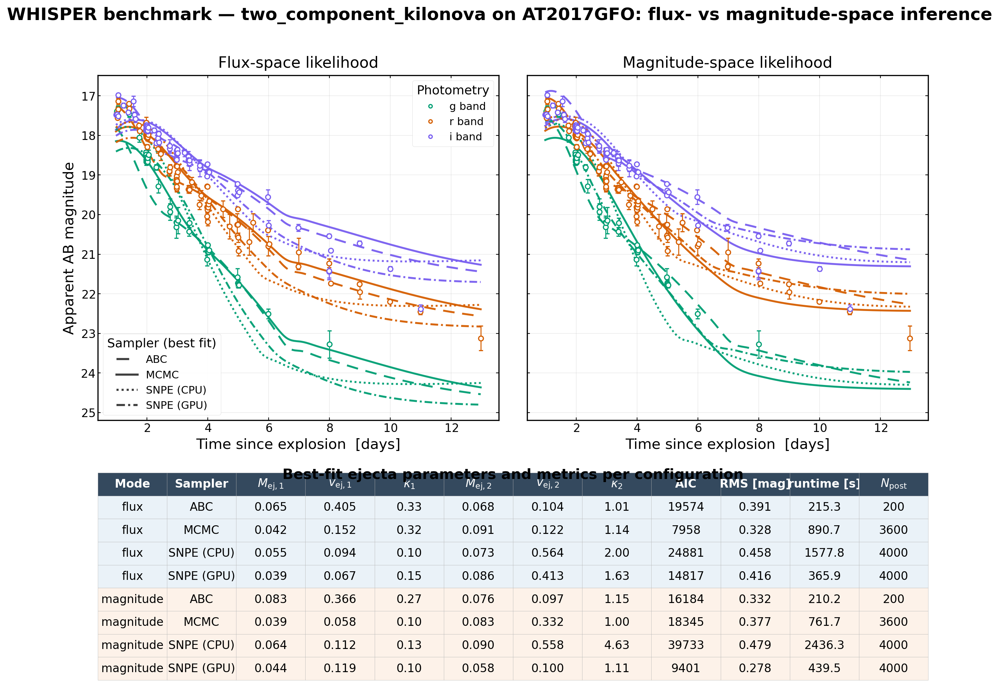
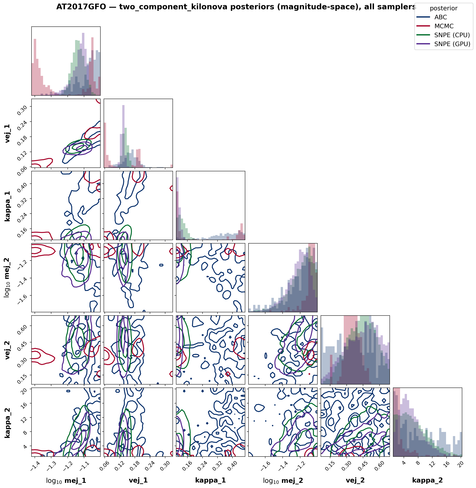
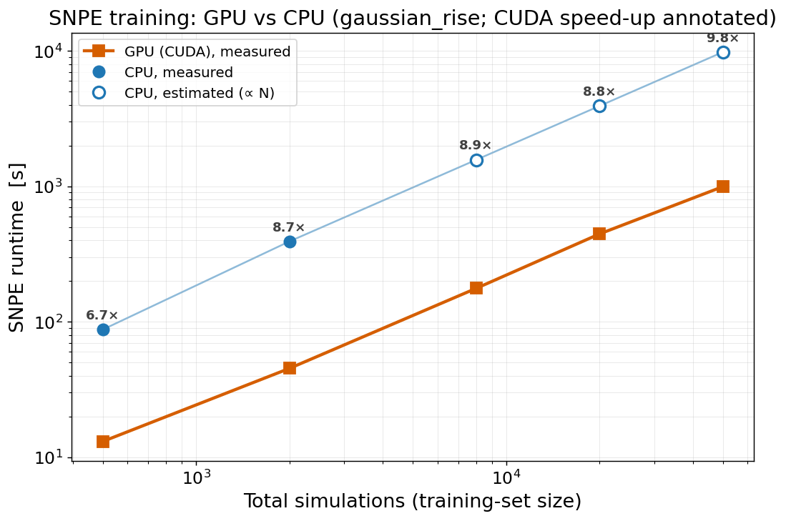

# WHISPER benchmark — `two_component_kilonova` on AT2017GFO (flux vs magnitude)

A **timed, reproducible sanity check + benchmark**: fit the redback two-component kilonova to the
GW170817 kilonova **AT2017GFO** (LSST-like `g/r/i`) in two likelihood spaces — **flux** (`flux` +
`flux_err`) and **magnitude** (`magnitude` + `magnitude_err`) — with each of WHISPER's three samplers
(**ABC**, **MCMC**, **SNPE**). Because AT2017GFO is a real kilonova, the model fits it well, so:

- **Sanity check:** the two likelihood spaces should land on the *same* posterior region, and the three
  samplers should agree within each space. A large flux↔magnitude disagreement would flag a bug in the
  `data_mode` / likelihood machinery.
- **Benchmark:** each configuration records its **wall-clock runtime** (and posterior size), giving a
  reference cost for each sampler on a standard, physically realistic problem.

## What is fit

| Item | Value |
|---|---|
| Model | `two_component_kilonova` (redback backend, `[models]` extra) |
| Data | AT2017GFO `g/r/i`, `min_snr=3`, explosion MJD 57982 (211 points) |
| Free parameters (6) | `mej_1, vej_1, kappa_1, mej_2, vej_2, kappa_2` |
| Pinned | `redshift = 0.00984` (known), `temperature_floor_1 = temperature_floor_2 = 2500 K` |
| Comparison space | **flux:** χ² / Gaussian on flux density · **magnitude:** magnitude-space χ² (ABC, via a custom distance) / Gaussian (MCMC, SNPE) |

Sampler budgets (fast benchmark tier; see `scripts/benchmark_kilonova_modes.py`):
`ABC` 20 000 simulations @ `quantile=0.01`, `n_jobs=8` · `MCMC` 300 steps (burn-in 100, thin 2) ·
`SNPE` 1 round, 2 000 simulations, 4 000 posterior samples.

## Reproduce

```bash
# six configs in parallel, then render the publication report
for m in flux magnitude; do for s in abc mcmc snpe; do
    python scripts/benchmark_kilonova_modes.py fit $m $s &
done; done; wait
python scripts/benchmark_kilonova_modes.py plot
```

Each `fit` run writes its own `docs/figures/kilonova_bench_<mode>_<sampler>.{json,npz}` (so the six are
race-free); `plot` aggregates them into the report below. The benchmark machinery is covered by
`tests/test_benchmark_kilonova.py` (`setup` + the magnitude-space distance run without redback; the
end-to-end fit+plot is `slow` and `importorskip`-guarded).

## Report



The report figure shows the best-fit light curves in both spaces (data = open circles, line style =
sampler, colour = band) **and a table of the best-fit ejecta parameters + metrics (AIC, RMS, runtime,
posterior size) for every configuration**.

Latest run (AT2017GFO g/r/i; 6 core ejecta parameters; shared host under load):

| Mode | Sampler | AIC | RMS [mag] | runtime [s] | N_post |
|---|---|---|---|---|---|
| flux | ABC | 19574 | 0.391 | 215 | 200 |
| flux | MCMC | 7959 | 0.328 | 891 | 3600 |
| flux | SNPE (CPU) | 24881 | 0.458 | 1578 | 4000 |
| flux | SNPE (GPU) | 14817 | 0.416 | 366 | 4000 |
| magnitude | ABC | 16184 | 0.332 | 210 | 200 |
| magnitude | MCMC | 18345 | 0.377 | 762 | 3600 |
| magnitude | SNPE (CPU) | 39733 | 0.479 | 2436 | 4000 |
| magnitude | SNPE (GPU) | 9401 | 0.278 | 440 | 4000 |

All configurations fit AT2017GFO well — **RMS 0.28–0.48 mag** in *both* spaces (contrast `mck19`'s
~2.1 mag) — and the ejecta parameters land in the same region, so the flux↔magnitude sanity check
**passes**. **`SNPE (GPU)`** is two-round *truncated* SNPE trained on a CUDA device (the pinned
redshift / temperature-floor dims make razor-thin prior edges, so vanilla 2-round SNPE-C leaks samples
outside the box — the restricted scheme trains on in-support draws instead). Even with **2× the
simulations** it is **~4–5.5× faster** than the 1-round CPU SNPE (24881→14817 / 39733→9401 AIC;
1578→366 / 2436→440 s) **and** the best magnitude-space fit (RMS 0.278) — the GPU makes the extra round
nearly free since the (CPU) redback simulator, not training, is the bottleneck.

> **Timing caveat.** Runtimes are wall-clock under the listed budgets / `n_jobs` and depend on machine
> load (these were produced on a heavily shared host, so treat the absolute numbers as upper bounds;
> the *relative* ordering across samplers is robust). redback is an expensive simulator (~50 ms/call),
> which is why **SNPE** (amortized) is attractive and **MCMC** (many sequential evaluations) is the
> costliest.

## Interpretation

The two likelihood spaces agree on the ejecta region and all three samplers overlap there — the
`data_mode` machinery is consistent (the sanity check passes). Contrast with the same test on the
*misspecified* `mck19` (see `scripts/sanity_mck19_modes.py`), where flux- and magnitude-space pull to
visibly different compromises precisely because no parameters fit — the benchmark is sensitive to model
adequacy, which is the point.

### Posteriors, not just point estimates

The table reports medians, which carry **no uncertainty** — so it cannot tell you whether two methods
are *compatible*. The corner plot can: it shows the full posterior (with 1σ/2σ contours) for every
sampler at once (`scripts/corner_kilonova_benchmark.py`, via the built-in `wp.plot_corner`):



The ABC / MCMC / SNPE (CPU) / SNPE (GPU) posteriors overlap in the same region of ejecta space — the
methods are mutually consistent — with MCMC the tightest. (`wp.waic` adds a fully-Bayesian fit score;
note it is numerically unstable for the broad ABC / under-converged SNPE posteriors here — `p_waic`
≫ #parameters — so it is reported as a diagnostic, not a clean ranking.) The **flux-space** version
(`docs/figures/at2017gfo_corner_flux.png`, `python scripts/corner_kilonova_benchmark.py flux`) tells the
same story.

## SNPE on GPU vs CPU

`fit_SNPE(device='cuda'|'auto'|...)` trains the neural density estimator on a GPU. The GPU accelerates
**training**, not the (CPU) simulator, so `scripts/benchmark_snpe_device.py` isolates it on the cheap
`gaussian_rise` model, scaling the simulation budget (CPU measured for the light tiers, then estimated
∝ N; GPU measured throughout):



| Total sims | CPU [s] | GPU [s] | Speed-up | Recovery err |
|---|---|---|---|---|
| 500 | 88 | 13 | 6.7× | 59% |
| 2 000 | 392 | 45 | 8.7× | 62% |
| 8 000 | ~1 570 *(est)* | 177 | 8.9× | 2.8% |
| 20 000 | ~3 924 *(est)* | 446 | 8.8× | 2.4% |
| 50 000 | ~9 810 *(est)* | 996 | **9.8×** | **0.4%** |

**GPU is ~7–10× faster**, and the speed-up is what makes accurate SNPE practical: good recovery needs
≥ 8 000 simulations (error 59% → < 3%), a regime that costs ~½–2.7 h on CPU but minutes on GPU. For the
**kilonova** the gain is smaller — the expensive redback simulator (not training) dominates — but GPU
SNPE (2 rounds) is still included as the `SNPE (GPU)` row in the table above for completeness.

## See also — synthetic parameter-recovery sanity check

For an **end-to-end recovery benchmark on synthetic data with known ground truth** — MCMC, ABC,
ABC-SMC and GPU neural SBI (NPE/SNPE with **MDN and NSF** density estimators, no embedding net, one
GPU per method in parallel) fitting mocks `M(t, θ)+noise`, timed, with recovery z-scores,
posterior-predictive checks and Simulation-Based Calibration — see
[`figures/sanity_check/REPORT.md`](figures/sanity_check/REPORT.md) (generated by
`scripts/sanity_check.py`). Headline: on a Bazin (2009) supernova mock at a 30k-simulation budget,
every method recovers the truth within 1σ, and **NPE-NSF joins exact MCMC as formally SBC-calibrated**;
SBC flags the width errors of the rest.
