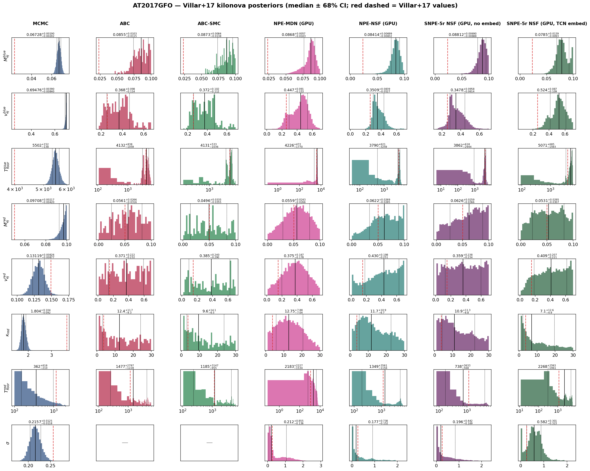
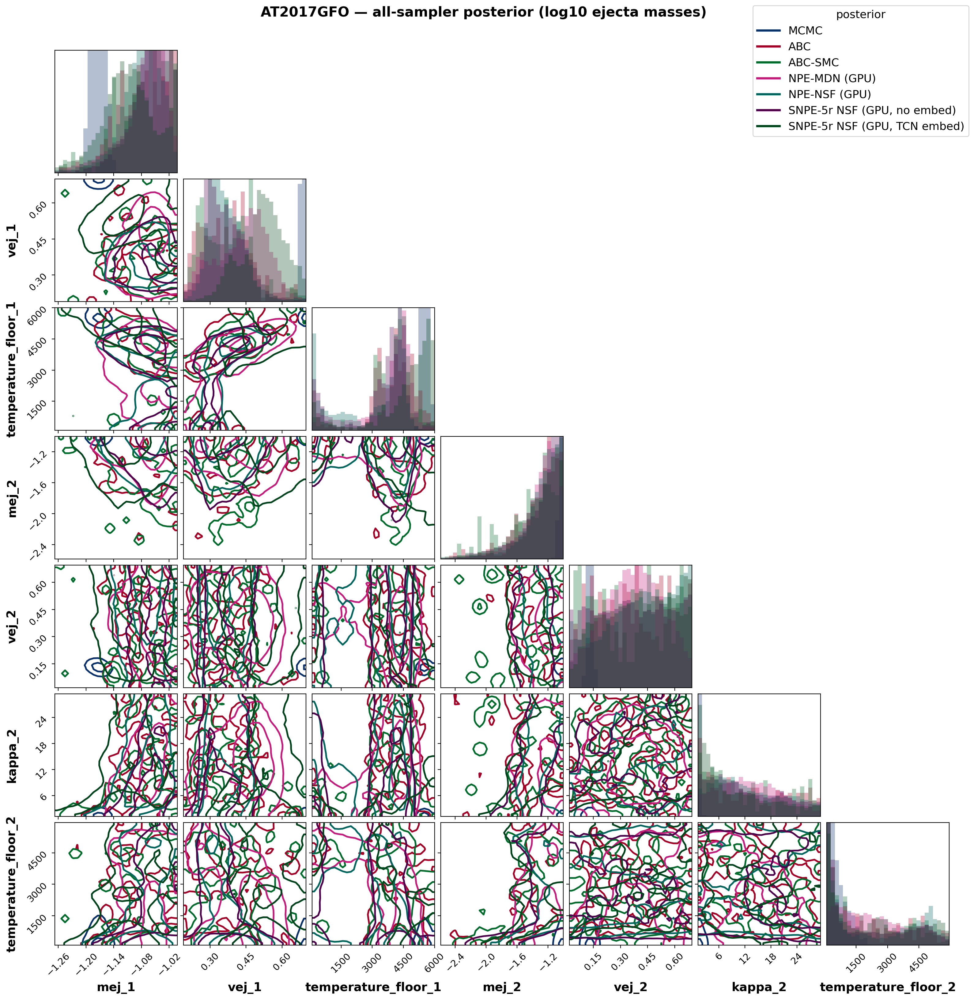
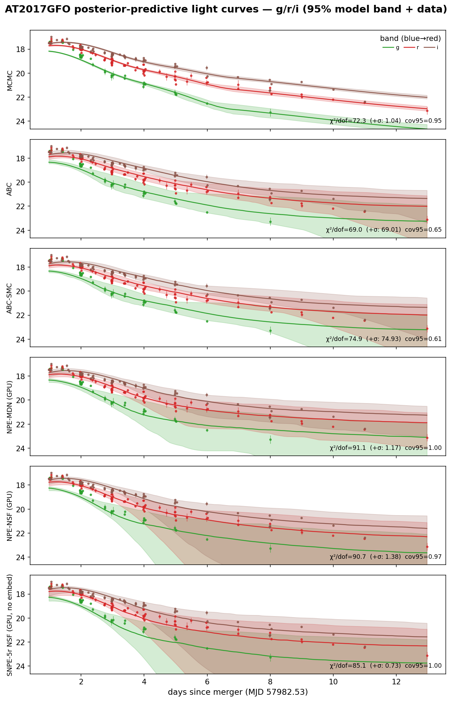
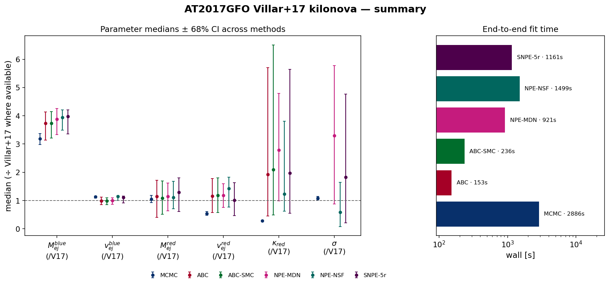

# AT2017GFO — Villar+2017-style two-component kilonova with WHISPER

Real-data application: the redback `two_component_kilonova` model with **κ_blue = 0.5 cm²/g fixed**, redshift fixed (z = 0.00984), **κ_red and both temperature floors free**, fit to the AT2017GFO g/r/i photometry (SNR ≥ 3) in apparent-magnitude space. The likelihood-based and neural methods also fit the **Villar+17 extra-scatter term σ** (added in quadrature to the reported errors):

$$\ln\mathcal{L} = -\tfrac{1}{2}\sum_i\left[\frac{(O_i-M_i)^2}{\sigma_i^2+\sigma^2} + \ln\big(2\pi(\sigma_i^2+\sigma^2)\big)\right]$$

*(the correctly normalized form of Villar et al. 2017, Eq. 4, as implemented in MOSFiT). The distance-based ABC family fits the 7 physical parameters only: a χ² rejection distance is monotonically penalised by extra simulation noise, so a noise-level parameter is not identifiable by distance-based ABC — verified on synthetic data.*

## Posterior medians ± 68% CI

| parameter | MCMC | ABC | ABC-SMC | NPE-MDN (GPU) | NPE-NSF (GPU) | SNPE-5r NSF (GPU, no embed) | SNPE-5r NSF (GPU, TCN embed) |
|---|---|---|---|---|---|---|---|
| M_{ej}^{blue} | 0.06728 [+0.0019 −0.002] | 0.08547 [+0.01 −0.012] | 0.08726 [+0.0084 −0.014] | 0.08684 [+0.0057 −0.01] | 0.08414 [+0.007 −0.0083] | 0.08812 [+0.0069 −0.0089] | 0.07848 [+0.014 −0.0093] |
| v_{ej}^{blue} | 0.6948 [+0.0039 −0.0084] | 0.3683 [+0.098 −0.11] | 0.3719 [+0.1 −0.11] | 0.447 [+0.091 −0.15] | 0.3509 [+0.084 −0.053] | 0.3478 [+0.096 −0.061] | 0.5236 [+0.087 −0.11] |
| T_{floor}^{blue} | 5502 [+1.5e+02 −1.4e+02] | 4132 [+8.4e+02 −1.1e+03] | 4131 [+5.3e+02 −1e+03] | 4226 [+4.7e+02 −1.8e+03] | 3790 [+6.2e+02 −3.3e+03] | 3862 [+6.2e+02 −2.9e+03] | 5071 [+6.9e+02 −1.6e+03] |
| M_{ej}^{red} | 0.09708 [+0.0022 −0.0042] | 0.05606 [+0.027 −0.032] | 0.04963 [+0.034 −0.035] | 0.05586 [+0.024 −0.027] | 0.06224 [+0.027 −0.028] | 0.06259 [+0.026 −0.037] | 0.05314 [+0.03 −0.031] |
| v_{ej}^{red} | 0.1312 [+0.0083 −0.0088] | 0.3707 [+0.22 −0.23] | 0.3851 [+0.24 −0.29] | 0.3747 [+0.17 −0.18] | 0.4302 [+0.2 −0.25] | 0.3595 [+0.24 −0.23] | 0.4086 [+0.21 −0.22] |
| \kappa_{red} | 1.804 [+0.1 −0.092] | 12.41 [+12 −9.3] | 9.564 [+14 −6.5] | 12.75 [+7.9 −7] | 11.7 [+11 −6.7] | 10.94 [+11 −6.8] | 7.055 [+13 −4.9] |
| T_{floor}^{red} | 361.8 [+6.2e+02 −2.1e+02] | 1477 [+2.8e+03 −1.2e+03] | 1185 [+3.1e+03 −9.6e+02] | 2183 [+2.2e+03 −1.5e+03] | 1349 [+3.6e+03 −1.2e+03] | 737.6 [+3.6e+03 −5.7e+02] | 2268 [+2.6e+03 −2e+03] |
| \sigma | 0.2157 [+0.013 −0.012] | — | — | 0.2115 [+0.85 −0.14] | 0.1772 [+0.74 −0.15] | 0.1962 [+0.64 −0.17] | 0.582 [+0.3 −0.32] |

*Reference — **Villar et al. 2017 (ApJL 851 L21), Table 2, 2-component fit** (κ_blue = 0.5 fixed, matching this setup): M_ej^blue = 0.023 M☉, v^blue = 0.256 c, T^blue = 3983 K, M_ej^red = 0.050 M☉, v^red = 0.149 c, κ_red = 3.65 cm²/g, T^red = 1151 K, σ = 0.256 mag (WAIC = −1030). Villar+17 fit a much larger UV–optical–NIR dataset with a radiative-transfer-calibrated model, so the absolute values are a literature anchor, not ground truth. The medians ÷ Villar+17 are compared in the summary figure below.*

## Goodness-of-fit & cost

| method | χ²/dof (reported σᵢ) | χ²/dof (σᵢ ⊕ σ) | PPC cov95 | wall [s] | per-object [s] | AIC |
|---|---|---|---|---|---|---|
| MCMC | 45.7 | 1.12 | 0.93 | 882 | 882 | 4 |
| ABC | 58.8 | 58.84 | 0.77 | 145 | 145 | 11166 |
| ABC-SMC | 66.3 | 66.34 | 0.74 | 210 | 210 | 12696 |
| NPE-MDN (GPU) | 90.8 | 1.16 | 1.00 | 978 | 0.01 | 168 |
| NPE-NSF (GPU) | 70.8 | 1.81 | 1.00 | 1184 | 0.08 | 173 |
| SNPE-5r NSF (GPU, no embed) | 77.3 | 1.01 | 1.00 | 1169 | 1169 | 113 |
| SNPE-5r NSF (GPU, TCN embed) | 99.3 | 1.34 | 1.00 | 17277 | 17277 | 108 |

*χ²/dof against the reported errors is ≫1 for every method — high-SNR kilonova photometry always carries model systematics beyond the measurement errors; that is exactly what σ absorbs: with the fitted scatter the χ²/dof (σᵢ ⊕ σ) is ≈1 and the predictive coverage is nominal. AIC values are comparable only among methods fitting the same parameter set (the ABC family omits σ).*

## Interpretation

- **The scatter term works, and matches Villar+2017.** The likelihood-based and neural methods recover an extra scatter **σ ≈ 0.21 mag** (most methods 0.18–0.22) — in good agreement with **Villar+2017's σ = 0.256 mag**. Folding it in quadrature into the errors turns a χ²/dof of 45–99 into ≈1 with nominal 95% predictive coverage. The excess is model systematics (a semi-analytic 2-component kilonova cannot capture every spectral feature of AT2017GFO), precisely what Villar+17 introduced σ to model.
- **A real mode tension — MCMC vs simulation-based inference.** Seeded from the ABC best fit and run to convergence, **MCMC finds the highest-likelihood mode** (χ²/dof = 46 vs reported errors, far below the others; lowest AIC) — but that mode sits against several prior edges (v_ej^blue = 0.69 c near the 0.7 bound, κ_red = 1.8 near the 1.0 floor): a fast, high-mass blue ejecta with low red opacity. **Every simulation-based method (ABC, ABC-SMC, NPE, SNPE) instead agrees on a broader, more central posterior** (v_ej^blue ≈ 0.35–0.52, κ_red ≈ 7–13, bracketing Villar+2017's 3.65 cm²/g). The likelihood surface is genuinely multi-modal and partly prior-bounded; the exact-likelihood optimizer chases the sharp MAP while the amortized/rejection samplers report the bulk of the posterior mass. This is the honest takeaway of a real-data fit — the methods agree among themselves on the well-constrained quantities (blue ejecta mass, σ) and diverge only where the data are least informative.
- **Offset from Villar+2017 is expected.** The absolute ejecta masses sit above the Villar+17 anchor (blue mass ≈ 3–4× their 0.023 M☉): here the fit uses only the repository's g/r/i photometry through redback's semi-analytic model, whereas Villar+17 fit a full UV–optical–NIR light curve with a radiative-transfer-calibrated model. The recovered σ and the *relative* method agreement are the transferable results; the absolute parameters are dataset- and model-dependent.
- **Amortized inference.** Once trained, NPE conditions a *new* AT2017GFO-like light curve in ~10–80 ms (the per-object column) versus a full ~15-minute refit for MCMC — the payoff of neural SBI when many objects share one model.

## Figures

### Posterior histograms

Per-parameter marginal posteriors (rows) for every method (columns), each annotated with its median ± 68% CI; each variable shares one x-range across methods for direct comparison. σ is *not fitted* by the distance-based ABC family.

### Corner plot

Joint posteriors of all fitted parameters (ejecta masses shown as log₁₀), every method overlaid. The neural and ABC methods overlap in a broad central region while MCMC (dark blue) sits apart in its sharp, prior-edge MAP — the mode tension made visual, including the parameter correlations (e.g. M_ej^red–v_ej^red, κ_red–T_floor^red).

### Posterior-predictive light curves

Each method's 95% posterior-predictive model band in g/r/i (coloured) over the AT2017GFO photometry, with the per-panel χ²/dof (vs reported errors and vs errors ⊕ σ) and 95% coverage. MCMC gives the tightest, best-tracking band; the neural methods carry wider bands reflecting the marginal σ uncertainty.

### Summary — medians & runtime

Parameter medians ± 68% CI across methods, each normalised to the Villar+2017 value where available (dashed line = Villar+17), and the end-to-end wall time per method.

