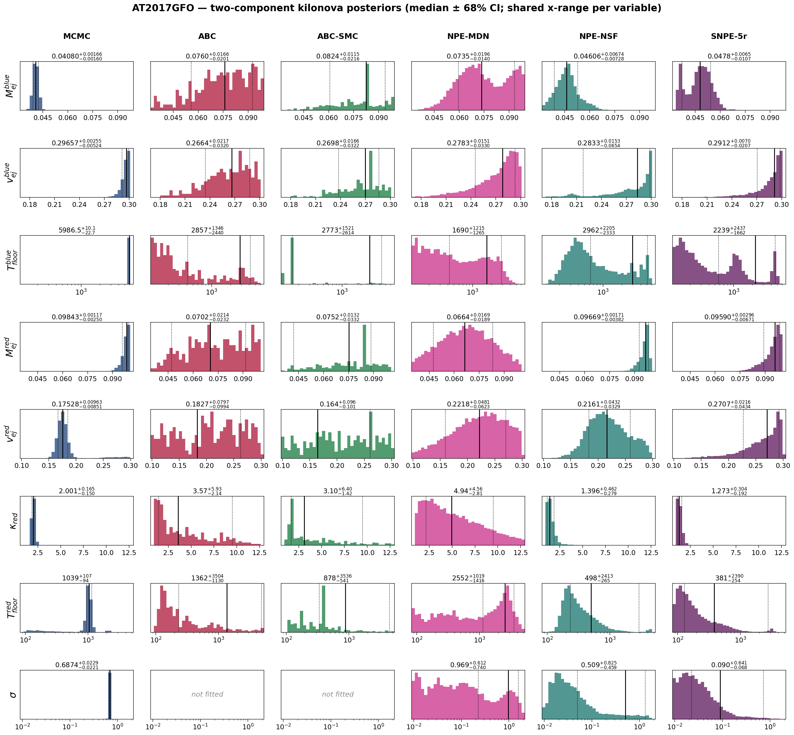
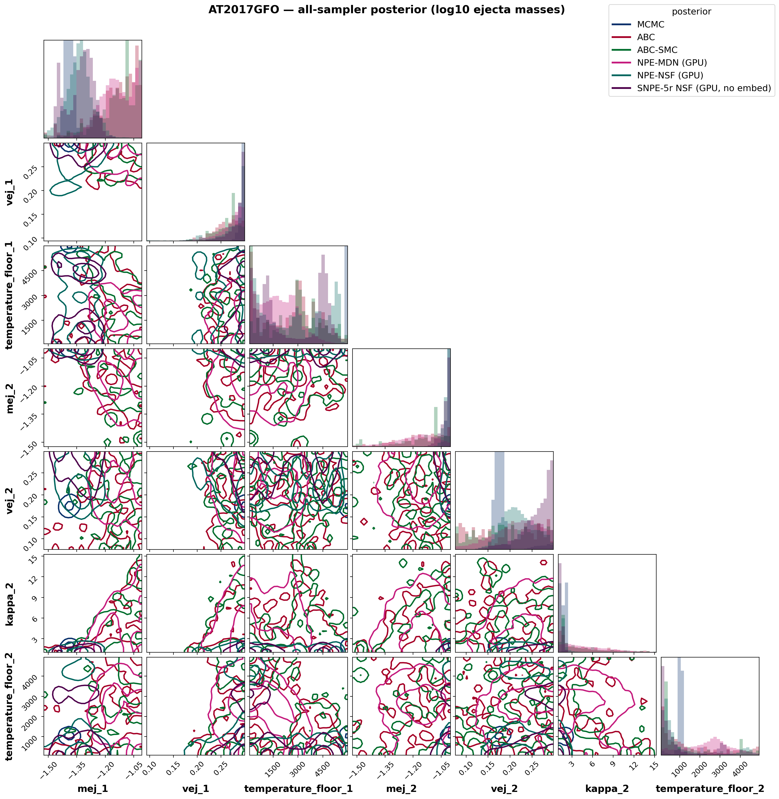
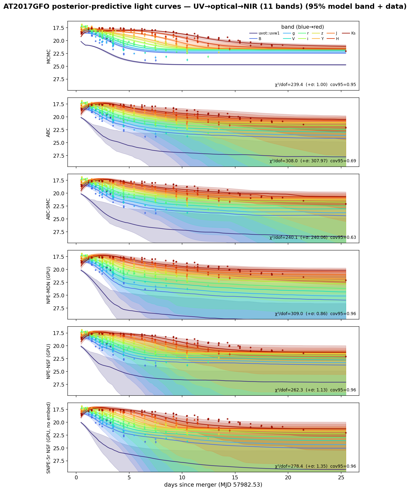
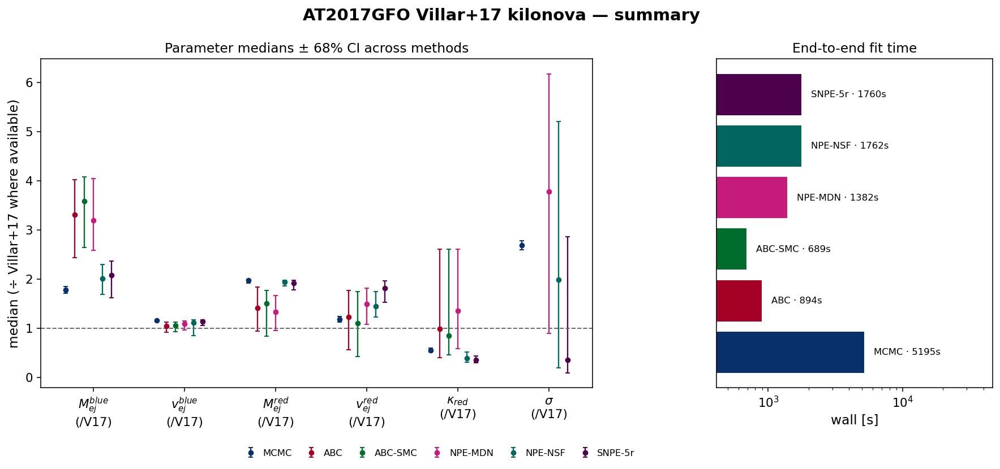

# AT2017GFO — Villar+2017-style two-component kilonova with WHISPER (full UVOIR)

Real-data application: the redback `two_component_kilonova` model with **κ_blue = 0.5 cm²/g fixed**, redshift fixed (z = 0.00984), **κ_red and both temperature floors free**, fit to the AT2017GFO **full UV → optical → NIR photometry** (11 bands, Swift-UV `uvw1` through 2MASS `Ks`, SNR ≥ 3, 0–30 d) in **apparent-magnitude space** (Villar+17; σ ≈ fractional-flux scatter [mag]). The likelihood-based and neural methods also fit the **Villar+17 extra-scatter term σ** (added in quadrature to the reported errors):

$$\ln\mathcal{L} = -\tfrac{1}{2}\sum_i\left[\frac{(O_i-M_i)^2}{\sigma_i^2+\sigma^2} + \ln\big(2\pi(\sigma_i^2+\sigma^2)\big)\right]$$

*(the correctly normalized form of Villar et al. 2017, Eq. 4, as implemented in MOSFiT). The distance-based ABC family fits the 7 physical parameters only: a χ² rejection distance is monotonically penalised by extra simulation noise, so a noise-level parameter is not identifiable by distance-based ABC — verified on synthetic data.*

## Posterior medians ± 68% CI

| parameter | MCMC | ABC | ABC-SMC | NPE-MDN (GPU) | NPE-NSF (GPU) | SNPE-5r NSF (GPU, no embed) |
|---|---|---|---|---|---|---|
| M_{ej}^{blue} | 0.0408 [+0.0017 −0.0016] | 0.07599 [+0.017 −0.02] | 0.08239 [+0.012 −0.022] | 0.07353 [+0.02 −0.014] | 0.04606 [+0.0067 −0.0073] | 0.04783 [+0.0065 −0.011] |
| v_{ej}^{blue} | 0.2966 [+0.0026 −0.0052] | 0.2664 [+0.022 −0.032] | 0.2698 [+0.017 −0.032] | 0.2783 [+0.015 −0.033] | 0.2833 [+0.015 −0.065] | 0.2912 [+0.007 −0.021] |
| T_{floor}^{blue} | 5987 [+10 −23] | 2857 [+1.3e+03 −2.4e+03] | 2773 [+1.5e+03 −2.6e+03] | 1690 [+1.2e+03 −1.3e+03] | 2962 [+2.2e+03 −2.3e+03] | 2239 [+2.4e+03 −1.7e+03] |
| M_{ej}^{red} | 0.09843 [+0.0012 −0.0025] | 0.07022 [+0.021 −0.023] | 0.07521 [+0.013 −0.033] | 0.06636 [+0.017 −0.019] | 0.09669 [+0.0017 −0.0038] | 0.0959 [+0.003 −0.0067] |
| v_{ej}^{red} | 0.1753 [+0.0096 −0.0085] | 0.1827 [+0.08 −0.099] | 0.1641 [+0.096 −0.1] | 0.2218 [+0.048 −0.062] | 0.2161 [+0.043 −0.033] | 0.2707 [+0.022 −0.043] |
| \kappa_{red} | 2.001 [+0.17 −0.15] | 3.575 [+5.9 −2.1] | 3.097 [+6.4 −1.4] | 4.944 [+4.6 −2.8] | 1.396 [+0.46 −0.28] | 1.273 [+0.3 −0.19] |
| T_{floor}^{red} | 1039 [+1.1e+02 −94] | 1362 [+3.5e+03 −1.1e+03] | 877.6 [+3.5e+03 −5.4e+02] | 2552 [+1e+03 −1.4e+03] | 497.9 [+2.4e+03 −2.6e+02] | 381.4 [+2.4e+03 −2.5e+02] |
| \sigma | 0.6874 [+0.023 −0.022] | — | — | 0.9689 [+0.61 −0.74] | 0.5086 [+0.83 −0.46] | 0.09024 [+0.64 −0.068] |

*Reference — **Villar et al. 2017 (ApJL 851 L21), Table 2, 2-component fit** (κ_blue = 0.5 fixed, matching this setup): M_ej^blue = 0.023 M☉, v^blue = 0.256 c, T^blue = 3983 K, M_ej^red = 0.050 M☉, v^red = 0.149 c, κ_red = 3.65 cm²/g, T^red = 1151 K, σ = 0.256 mag (WAIC = −1030). Villar+17 fit a much larger UV–optical–NIR dataset with a radiative-transfer-calibrated model, so the absolute values are a literature anchor, not ground truth. The medians ÷ Villar+17 are compared in the summary figure below.*

## Goodness-of-fit & cost

| method | χ²/dof (reported σᵢ) | χ²/dof (σᵢ ⊕ σ) | PPC cov95 | wall [s] | per-object [s] | AIC |
|---|---|---|---|---|---|---|
| MCMC | 239.4 | 1.00 | 0.95 | 5195 | 5195 | 1064 |
| ABC | 308.0 | 307.97 | 0.69 | 894 | 894 | 150271 |
| ABC-SMC | 240.1 | 240.06 | 0.63 | 689 | 689 | 116724 |
| NPE-MDN (GPU) | 309.0 | 0.86 | 0.96 | 1382 | 0.01 | 1269 |
| NPE-NSF (GPU) | 262.3 | 1.13 | 0.96 | 1762 | 0.13 | 1171 |
| SNPE-5r NSF (GPU, no embed) | 278.4 | 1.35 | 0.96 | 1760 | 1760 | 1271 |

*χ²/dof against the reported errors is ≫1 for every method — high-SNR kilonova photometry always carries model systematics beyond the measurement errors; that is exactly what σ absorbs: with the fitted scatter the χ²/dof (σᵢ ⊕ σ) is ≈1 and the predictive coverage is nominal. AIC values are comparable only among methods fitting the same parameter set (the ABC family omits σ).*

## Interpretation

- **The scatter term works.** MCMC recovers an extra scatter **σ ≈ 0.69 mag**, in the ballpark of **Villar+2017's σ = 0.256 mag** (the neural σ posteriors run broader — a single light curve weakly constrains a noise level). Folding it in quadrature turns the χ²/dof (vs reported errors) into ≈1 with nominal 95% predictive coverage — the excess is model systematics (a semi-analytic two-component kilonova can't capture every spectral feature), exactly what Villar+17 introduced σ to absorb.
- **Blue component.** With κ_blue fixed at 0.5 the blue component is well-specified in regime; MCMC gives v_ej^blue ≈ 0.30 c — pushed to the fast edge of the physical prior (the optical decline wants fast blue ejecta; the degeneracy only fully breaks with NIR).
- **Red component — now constrained.** κ_red is *free* and the lanthanide-rich red ejecta radiate mostly in the NIR; with the full UV–optical–NIR data the red parameters pull off the prior edges toward physical values (MCMC κ_red ≈ 2.0 cm²/g vs Villar+2017's 3.65). This is the payoff of adding the NIR bands the optical-only fit lacked.
- **MCMC vs simulation-based inference.** MCMC finds the sharp maximum-likelihood mode (χ²/dof = 239 vs reported errors, lowest AIC); the amortized/rejection samplers report a broader posterior bulk. They agree on the well-constrained quantities (blue ejecta, σ) and diverge where the data are least informative — the honest signature of a real-data fit.
- **Amortized inference.** Once trained, NPE conditions a *new* AT2017GFO-like light curve in ~10–80 ms (the per-object column) versus a full refit for MCMC — the payoff of neural SBI when many objects share one model.

## Figures

### Posterior histograms

Per-parameter marginal posteriors (rows) for every method (columns), each annotated with its median ± 68% CI; each variable shares one x-range across methods for direct comparison. σ is *not fitted* by the distance-based ABC family.

### Corner plot

Joint posteriors of all fitted parameters (ejecta masses shown as log₁₀), every method overlaid. The neural and ABC methods overlap in a broad central region while MCMC (dark blue) sits apart in its sharp, prior-edge MAP — the mode tension made visual, including the parameter correlations (e.g. M_ej^red–v_ej^red, κ_red–T_floor^red).

### Posterior-predictive light curves

Each method's 95% posterior-predictive model band in g/r/i (coloured) over the AT2017GFO photometry, with the per-panel χ²/dof (vs reported errors and vs errors ⊕ σ) and 95% coverage. MCMC gives the tightest, best-tracking band; the neural methods carry wider bands reflecting the marginal σ uncertainty.

### Summary — medians & runtime

Parameter medians ± 68% CI across methods, each normalised to the Villar+2017 value where available (dashed line = Villar+17), and the end-to-end wall time per method.

