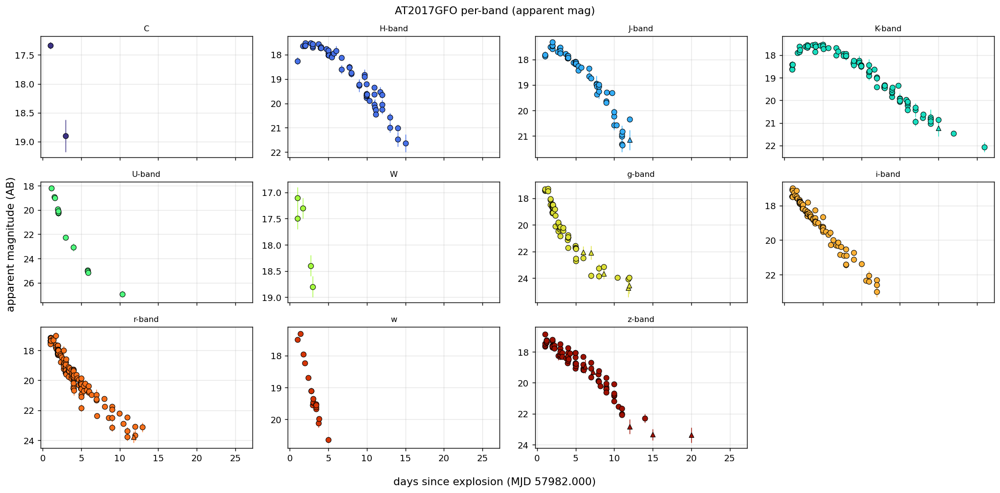
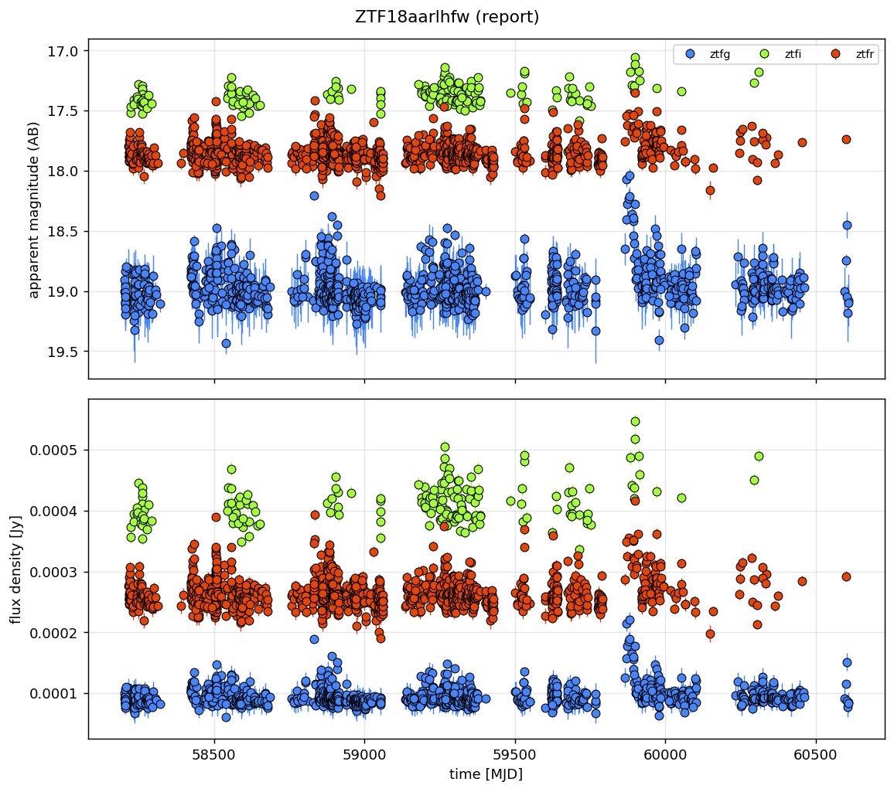
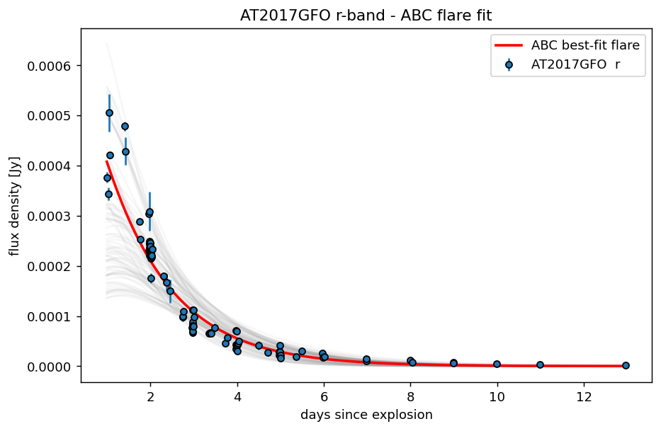
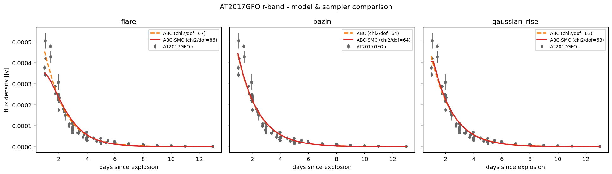
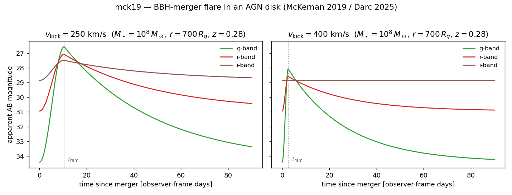
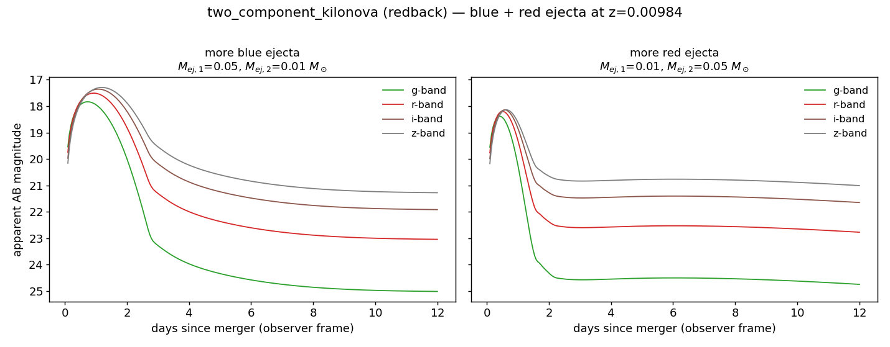

# Whisper Tutorial — working with transient light curves

A hands-on tour of what Whisper can do today — **data ingestion, plotting, and fitting** (ABC, ABC-SMC,
and SNPE). Import once:

```python
import whisper_labia as wp
```

---

## 1. Load a light curve

`load_lightcurve` reads almost any photometry CSV and works out the columns for you.

```python
lc = wp.load_lightcurve("tests/data/at2017gfo.csv")
print(lc)
# LightCurve(name='at2017gfo', n_points=645, bands=[...29 labels...], mode='magnitude')
```

It auto-detects `time/MJD`, `magnitude`/`flux`, their errors, `band` and `system` columns (override
with `column_map={'time': 'MJD', ...}`), sniffs comma- vs semicolon-separated files, and drops
obviously bad rows (non-finite values, non-positive errors).

## 2. Inspect it

`LightCurve` **is an `astropy.table.Table`** — per-point quantities are columns, scalar metadata lives
in `.meta`, and every table operation works directly:

```python
lc['mag_plus_5'] = lc['magnitude'] + 5     # add / compute columns
bright = lc[lc['magnitude'] < 18]          # boolean-mask slicing (keeps the LightCurve + .meta)
lc.sort('time'); lc.group_by('band')       # any astropy Table method
lc()                                       # __call__ -> the table itself
```

The common quantities are also attributes (handy, and what the samplers use):

```python
lc.n_points              # number of points (== len(lc))
lc.bands                 # sorted unique band labels
lc.time, lc.flux, lc.magnitude   # column data as arrays (None if absent; settable)
lc.data_mode             # 'flux_density' | 'magnitude' | 'flux'  (in .meta)
lc.output_format         # forward-model comparison space: 'magnitude' | 'flux_density'
lc.redshift_known        # True/False — False means a redshift prior must be sampled
lc.snr                   # per-point signal-to-noise (computed from the errors)
lc.to_dataframe()        # a pandas view (== lc.to_pandas())
```

**Select** with `where(...)` (`col` / `col_min` / `col_max` / `col_not`, list = OR), or `select_*`:

```python
lc.where(band='r', time_min=58000, time_max=58020, upper_limit=False)
```

## 3. Clean & shape — chainable, each call returns a **new** `LightCurve`

```python
lc = (wp.load_lightcurve("tests/data/at2017gfo.csv", band_lookup=True)  # group bands
        .select_snr(min_snr=5)               # keep SNR >= 5
        .select_time_window(time_max=57990)  # MJD window
        .set_explosion_date(57982.0))        # time -> days since explosion (day 0)
```

…or do it all at load time:

```python
lc = wp.load_lightcurve("tests/data/at2017gfo.csv",
                        band_lookup=True, min_snr=5, time_max=57990, explosion_date=57982.0)
```

### Band grouping
Surveys label filters inconsistently. `band_lookup=True` collapses them into an effective ladder
(`U/g/r/i/z/J/H/K-band` + JWST) using `wp.FILTER_LOOKUP` — e.g. `B→g-band`, `V→r-band`, `Ks→K-band`,
`F606W→r-band`. Clear/white-light bands (`C`, `W`, `w`) are kept as-is. AT2017GFO's 29 raw labels
collapse to 11 effective bands this way.

### Signal-to-noise cut
```python
wp.load_lightcurve("tests/data/at2017gfo.csv").n_points              # 645
wp.load_lightcurve("tests/data/at2017gfo.csv", min_snr=3).n_points   # 632
wp.load_lightcurve("tests/data/at2017gfo.csv", min_snr=5).n_points   # 578
```

## 4. Convert magnitude ↔ flux

```python
lc.add_flux()      # AB magnitudes -> flux density (Jy), with error propagation
flux_lc.add_mag()  # flux -> AB magnitudes
```

`add_flux`/`add_mag` use the constant **AB 3631 Jy** zero point (so the modelling flux the samplers see
stays on one zero point). Pass `zeropoint_jy=lc.zero_point` to opt into the per-band LSST/SVO zero
points instead.

### Rest-frame phase and absolute magnitude

```python
ph = lc.set_explosion_date(57982.0).calc_phase()     # rest-frame phase = (t − ref)/(1+z); adds 'phase'
pk = lc.calc_phase(peak=True)                         # phase relative to the brightest detection
ab = lc.calc_absmag(ebv=0.1)                          # absmag = mag − dm − A_band
```

`calc_phase` uses the curve's redshift for the `(1+z)` time dilation (reference defaults to the
explosion epoch, the peak, or the first detection). `calc_absmag` gets the distance modulus from the
redshift (Planck18) or `luminosity_distance`, and Milky-Way extinction from `ebv`/`rv` (CCM89, per
band's effective wavelength) or an explicit `extinction={'r': 0.3, ...}` dict. Both add a column and
record what they used in `.meta`.

## 5. Data mode, redshift, units & band resolution

These four are wired into `load_lightcurve` and the `LightCurve` itself.

### Data mode
`data_mode` is `flux_density` (canonical unit Jy, default), `magnitude` (dimensionless AB), or `flux`
(band-integrated erg/s/cm²). It is inferred from the columns but you can set it explicitly. To fill in
the other photometry column, call `add_flux()` / `add_mag()` (the light curve is a table, so the new
column is just added):

```python
lc = lc.add_mag()        # adds a 'magnitude' column from 'flux' (constant AB zero point)
lc.output_format         # 'flux_density' / 'magnitude' — the forward-model comparison space
```

### Redshift — argument > column > unknown (never silently assumed)
```python
wp.load_lightcurve("sn.csv", redshift=0.034)        # explicit
wp.load_lightcurve("sn.csv")                        # a 'redshift' column is picked up automatically
```
If neither is present the load **does not fail** — the curve is flagged `redshift_known=False`, carries a
default `redshift_prior` you can override, and warns that *z will be sampled, not assumed*. Validation:
`z ≥ 0`; `z == 0` needs an explicit `luminosity_distance=` (Mpc); negative/NaN is a hard error.

```python
lc.redshift_known        # False
lc.redshift_prior        # {'type': 'Uniform', 'low': 0.001, 'high': 1.0, 'name': 'redshift'}
wp.load_lightcurve("z0.csv", redshift=0.0, luminosity_distance=40.0)   # z=0 case
```

### Units (astropy) — F_ν or F_λ in, canonical Jy out
Flux density may arrive as **F_ν** (Jy/mJy/µJy) or **F_λ** (erg/s/cm²/Å). Pass the unit and Whisper
stores Jy internally; the F_λ→F_ν conversion uses each band's effective wavelength
(`u.spectral_density`):

```python
wp.load_lightcurve("fnu.csv",  flux_unit="mJy")                  # F_nu
wp.load_lightcurve("flam.csv", flux_unit="erg/(s cm2 AA)")       # F_lambda -> Jy via band wavelength
```
Magnitudes must be dimensionless AB (a flux unit on a magnitude column is a clear error). A flux column
with **no** unit warns and assumes the documented default (Jy) — pass `flux_unit=` to silence it.

### Bands — FILTER_LOOKUP, then SVO fallback
Each band resolves to an effective wavelength + zero point. Known filters come from `FILTER_LOOKUP`
(optical bands anchored to LSST ugrizy); an unknown band warns and falls back to the **SVO Filter
Profile Service**:

```python
wp.resolve_band("g")                 # {'source':'lsst', 'lambda_eff':4866.0, 'zero_point':3631.0, ...}
wp.resolve_band("PAN-STARRS/PS1.w")  # warns, then queries SVO (cached by filter ID; offline-safe)
```
SVO results are cached locally, so re-runs never re-query. If SVO is unavailable (no network /
astroquery), the load degrades gracefully and you can supply the band by hand:

```python
wp.register_manual_band("my_filter", lambda_eff=9000.0, zero_point=3631.0)
```
> SVO needs the optional `[svo]` extra (`pip install 'whisper-labia[svo]'`, which adds `astroquery`).
> A runnable, **offline** tour of all four features is in [`scripts/demo_ingestion.py`](../scripts/demo_ingestion.py).

## 6. Plot

### Report (overview): apparent magnitude **and** flux, all bands overlaid
```python
wp.plot_light_curve(lc, layout="report")
```


### Per-band grid: one box per band, choose the quantity
```python
wp.plot_light_curve(lc, layout="grid", quantity="apparent_mag", ncols=4)
```


`quantity` can be `"apparent_mag"`, `"flux"`, or `"absolute_mag"` (the latter needs `redshift=` set on
the curve, e.g. `load_lightcurve(..., redshift=0.0099)`).

**Marker conventions:** each band gets a distinct color; **detections** are circles with a black edge;
**SNR < 3** points are up-triangles (△); **upper limits** are down-triangles (▽); magnitude axes are
inverted (brighter = up).

### Any survey format works
The same one-liner on raw ZTF photometry (`zg`/`zr` → `ztfg`/`ztfr`, with the `catflags` quality flag):
```python
ztf = wp.load_lightcurve("tests/data/ztf18aarlhfw.csv", flag_filters={"catflags": 0})
wp.plot_light_curve(ztf, layout="report")
```


---

## 7. Fit a model with ABC

Whisper has two pluggable axes — **models** and **samplers**:

```python
wp.list_models()     # ['bazin', 'flare', 'gaussian_rise']  (+ your own via register_model)
wp.list_samplers()   # ['abc', 'abc_smc', 'npe', 'snpe']     (+ your own via register_sampler)
```

The built-in **flare** model is `flux = A·(1 − e^(−t/t_rise))·e^(−t/t_decay)`. Fit it to AT2017GFO's
r-band with **Approximate Bayesian Computation** (parallel rejection sampling):

```python
lc = wp.load_lightcurve("at2017gfo.csv", explosion_date=57982.0, min_snr=3)
r  = lc.select_bands("r")

fmax  = r.add_flux().flux.max()                       # scale the amplitude prior to the data
prior = wp.Prior({"amplitude":  wp.Uniform(0, 10*fmax),
                  "rise_time":  wp.Uniform(0.05, 10),
                  "decay_time": wp.Uniform(0.5, 40)})

res = wp.fit_ABC(r, "flare", prior=prior, n_simulations=200_000, quantile=0.005, n_jobs=16)
print(res)                 # SamplerResult(sampler='abc', model='flare', n_samples=1000, AIC=..., runtime=1.2s)
res.summary["amplitude"]   # {'median':..., 'ci16':..., 'ci84':...}
res.best_params            # best-fit parameter dict
res.to_json("fit.json")    # AIC, BIC, max-likelihood, posterior summary, diagnostics
```



The flare model tracks the r-band decline well. (Its reduced χ² is high only because the photometry
is high-SNR — tiny error bars magnify any model imperfection; physically-motivated models come later.)

- **Acceptance** is by `quantile` (keep the best fraction — robust default) or a fixed `threshold`.
- **Metrics:** the χ² distance equals −2 ln L for a Gaussian likelihood, so ABC reports
  `max_log_likelihood`, `AIC` and `BIC` for model comparison.

### It runs in parallel
Simulations are split across processes (`n_jobs`). On this machine (200k simulations):

| n_jobs | time | sims/s |
|---|---|---|
| 1 | 7.25 s | 27,600 |
| 8 | 1.90 s | 105,000 |
| 32 | 1.73 s | 115,000 |

(~4× here; for expensive physical models the speedup scales further.)

### Bring your own model / distance
```python
import numpy as np
def my_model(params, times, bands=None):
    return params["a"] * np.exp(-times / params["tau"])

wp.register_model("expdecay", my_model, ["a", "tau"],
                  prior=wp.Prior({"a": wp.Uniform(0, 1), "tau": wp.Uniform(1, 50)}))
res = wp.fit_ABC(lc, "expdecay", n_jobs=1)   # n_jobs=1 for closures; module-level fns run in parallel
```
A custom distance is any `f(obs_flux, obs_flux_err, sim_flux, bands) -> float` passed as `distance=`.

### ABC-SMC and more models

There's also **ABC-SMC** (sequential rejection over rounds of shrinking threshold) and two more
built-in models — **`bazin`** (SN rise+fall) and **`gaussian_rise`** (Gaussian rise + exp decay):

```python
wp.fit_ABC_SMC(r, "bazin", prior=prior, n_particles=1000, n_rounds=8, quantile=0.4, n_jobs=32)
```

A full **model-comparison report** (3 models × both samplers on AT2017GFO) is in
[`REPORT_at2017gfo.md`](REPORT_at2017gfo.md) — there ABC-SMC matches flat ABC's fit with **~4× fewer
simulations**.



### A physical, band-dependent model: `mck19`

The toy models above ignore the band. **`mck19`** is a built-in *physical* model — the optical flare
from a **binary-black-hole merger in an AGN disk** (McKernan 2019; implementation of Darc 2025). A
GW-recoil-kicked remnant shocks a bound-gas hotspot that radiates as a blackbody: a `sin²` rise to the
ram-pressure delay `t_ram`, then exponential decay back to the disk baseline. It returns **flux density
per band** (the blackbody is evaluated at each band's effective wavelength and the source redshift), so
g/r/i differ — and it fits with any sampler through the same likelihood:

```python
res = wp.fit_MCMC(lc, "mck19", nsteps=2000)   # params: v_kick, M_smbh, M_bh, r_bh, redshift
```

Because the data is in magnitude space the likelihood compares in magnitude automatically (the model
predicts flux). `scripts/demo_mck19.py` renders the light curve:



### A redback-backed model: `two_component_kilonova`

WHISPER can also drive **redback** models (the optional `[models]` extra). **`two_component_kilonova`**
wraps redback's blue + red kilonova: WHISPER bands map to redback LSST filters, and redback's
band-integrated AB magnitude is converted to WHISPER's flux density — so it fits through the *same*
samplers and likelihood as everything else. redback is imported lazily, so the package works without it
(only `predict` needs the extra).

```python
res = wp.fit_SNPE(lc, "two_component_kilonova", num_simulations=3000)   # SNPE suits the slow simulator
```

It's an expensive simulator (~50 ms/call), so **SNPE** (which amortizes simulation cost) is the natural
sampler; ABC/MCMC work with modest budgets. Because AT2017GFO is a real kilonova, this model fits it
well (low residual, no prior-railing) — the clean counterpart to the `mck19` exercise above.
`scripts/demo_kilonova.py` renders the light curve (note the blue bands fading faster — kilonova
reddening):



### Likelihoods & space (flux vs magnitude)

All inference can run in **flux** or **apparent-magnitude** space, with Gaussian, upper-limit, and
mixture (outlier-robust) likelihoods (`whisper_labia.likelihood`). The default is chosen by data type;
override for edge cases (non-detections, outliers):

```python
from whisper_labia.likelihood import make_likelihood, GaussianLikelihoodWithUpperLimits
lik = make_likelihood(lc, space="magnitude")                 # default by data type; override space/kind
lik = GaussianLikelihoodWithUpperLimits(lc, space="flux")    # use non-detections in flux space
```

(For ABC the likelihood enters via the χ² distance; **MCMC and SNPE use these likelihoods directly** —
see below. Routing a chosen likelihood into ABC's acceptance is the next step.)

### MCMC (emcee)

Likelihood-based posterior sampling with affine-invariant ensemble MCMC. It reuses the **same**
likelihood as the other samplers (so it respects the data's `data_mode` — flux data is fit in flux
space, magnitude data in magnitude space), and `emcee` is a core dependency (no extra needed):

```python
res = wp.fit_MCMC(r, "flare", nsteps=5000, burnin=1000, thin=10, seed=0)
print(res)                              # SamplerResult(sampler='mcmc', ..., AIC=..., runtime=...s)
res.summary["amplitude"]               # median / ci16 / ci84, same as every sampler
res.info["mean_acceptance_fraction"]   # diagnostics; res.emcee_sampler is the raw emcee object
```

Walkers initialise from the prior (no starting guess required); pass `initial_guess={...}` to start from
a point instead. Sampling is **seeded and reproducible**.

### All samplers agree — a sanity check

ABC, ABC-SMC, MCMC and SNPE share Whisper's model + prior + likelihood, so on the same data they reach
**the same posterior**. [`scripts/compare_samplers.py`](../scripts/compare_samplers.py) fits all four to
`gaussian_rise` and overlays them in one corner plot:


### Neural posterior estimation (SNPE)

Whisper also ships **Sequential Neural Posterior Estimation** (`snpe` / `npe`), a simulation-based
inference method powered by [`sbi`](https://sbi-dev.github.io/sbi/). Instead of an explicit likelihood,
it trains a neural density estimator on `(parameters, simulated light curve)` pairs and conditions it on
your data. The same model + prior + `LightCurve` you use everywhere else just work:

```python
res = wp.fit_SNPE(r, "flare", prior=prior,
                  num_rounds=2,            # 1 = amortized NPE; >1 = sequential SNPE
                  num_simulations=2000,    # per round
                  space="auto")            # 'flux' | 'magnitude' | 'auto', like the likelihoods
print(res)                                  # SamplerResult(sampler='snpe', ..., AIC=..., runtime=...s)
res.summary["amplitude"]                    # median / ci16 / ci84, same as every sampler
res.best_params; res.aic; res.bic           # exact Gaussian AIC/BIC at the best posterior draw
res.to_json("snpe_fit.json")
```

The simulator is Whisper's forward model (`model.predict` at the observed times/bands) with Gaussian
noise matching the data errors — so SNPE's implicit likelihood agrees with `GaussianLikelihood`. The
trained sbi posterior is attached for resampling or an sbi corner plot:

```python
samples = res.posterior.sample((10000,))    # resample the trained posterior
from sbi.analysis import pairplot
pairplot(samples, labels=res.parameters)
# or use Whisper's own samples DataFrame with corner: corner.corner(res.samples)
```

**Advanced / flexible options** (for harder, high-dimensional or multi-band problems):

```python
import torch.nn as nn
res = wp.fit_SNPE(
    r, "flare", prior=prior,
    embedding_net=nn.Sequential(nn.Linear(len(r), 64), nn.ReLU(), nn.Linear(64, 16)),  # learn features from x
    density_estimator="nsf", hidden_features=64, num_transforms=8,                      # custom architecture
    proposal_mode="restricted", truncate_quantile=1e-4, support_samples=10_000,         # truncated SNPE (TSNPE)
    num_workers=8,                                                                       # parallel simulation
)
```

- **`embedding_net`** — any `torch.nn.Module` mapping the simulated light curve to features (its input
  dim must equal the number of light-curve points); essential when the data vector is large.
- **`density_estimator`** — a name (`'maf'`/`'nsf'`/`'mdn'`) **or** a pre-built `posterior_nn(...)`
  factory; `hidden_features` / `num_transforms` / `num_bins` tune the built-in architectures.
- **`proposal_mode='restricted'`** — truncated SNPE (`RestrictedPrior` + `get_density_thresholder`),
  sometimes more robust than the default SNPE-C. It rejection-samples the restricted prior, so it can be
  **compute-heavy** — give it enough `num_simulations` and keep `support_samples` modest.

> `snpe` needs the optional `[sbi]` extra (`pip install 'whisper-labia[sbi]'`, adds `sbi` + `torch`).
> Runnable: [`scripts/demo_snpe.py`](../scripts/demo_snpe.py) and the notebook
> [`examples/at2017gfo_quickstart.ipynb`](../examples/at2017gfo_quickstart.ipynb). Training is the slow
> part — its tests are marked `slow` (`pytest -m "not slow"` skips them).

## What's next

Next: wire likelihoods into the samplers (flux/magnitude space + upper limits in inference), then a
**likelihood-based sampler** (MCMC / Dynesty). Physical models + priors can optionally be plugged in
from the external redback package (the `[models]` extra) — an auxiliary source of models and priors only.
