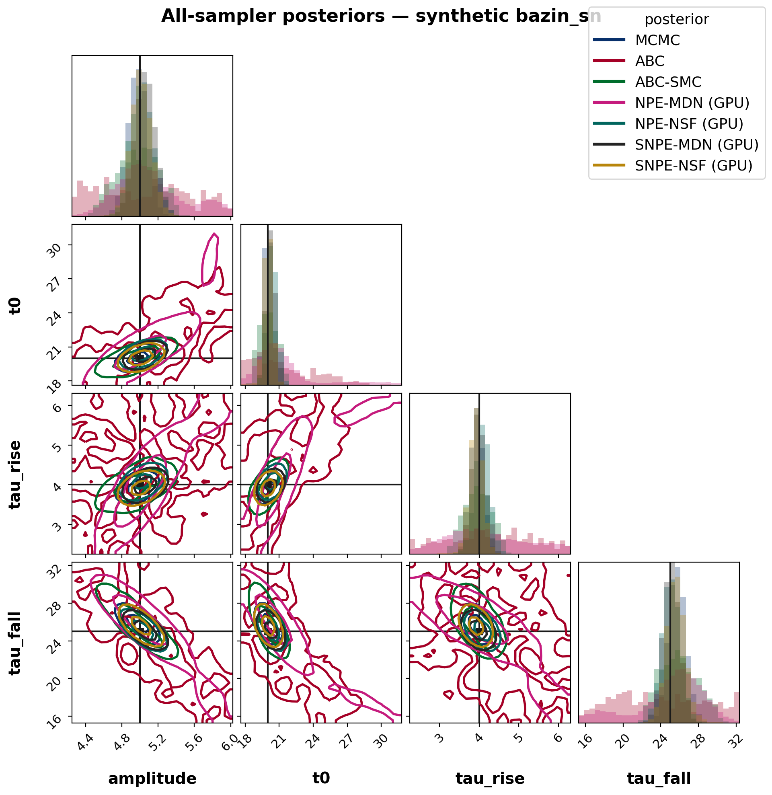
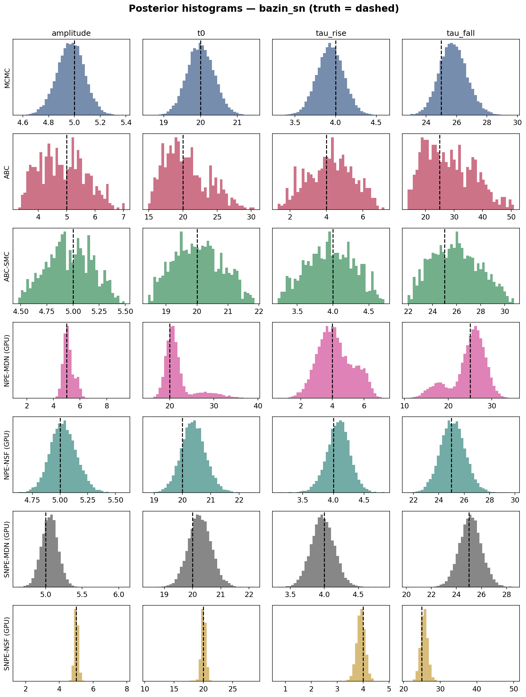
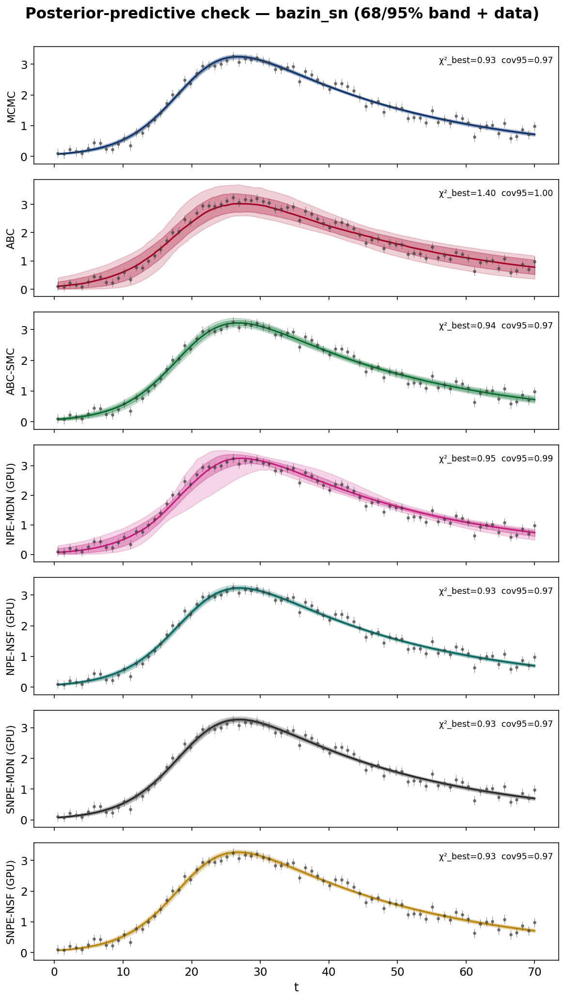
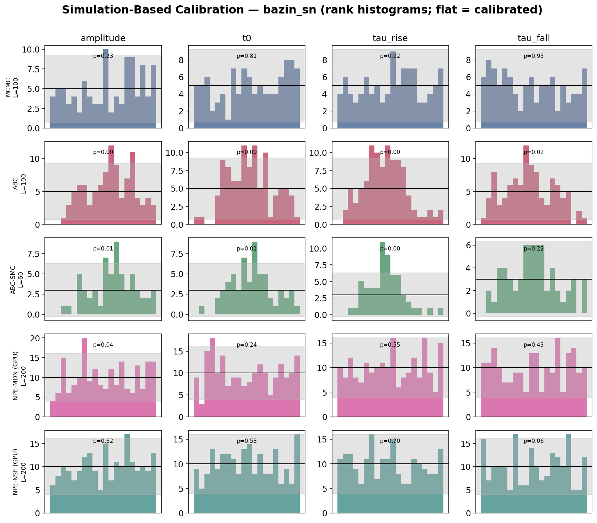
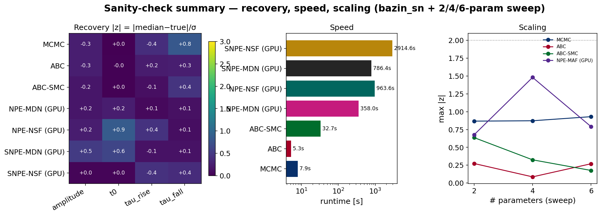
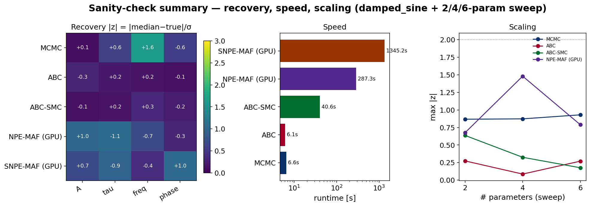

# WHISPER sanity check & benchmark — synthetic parameter recovery

Synthetic light curves `M(t, θ) + white noise` with **known ground truth**, fit by every WHISPER sampler, timed, and validated statistically (recovery z-scores, credible-interval coverage, posterior-predictive checks, Simulation-Based Calibration). Showcases: a physically-motivated **Bazin (2009) supernova** light curve (30k-simulation neural budgets, MDN + NSF density estimators) and a **damped sinusoid** (correlated, oscillatory stress test), plus a 2/4/6-parameter dimensionality sweep.

*Disclosure:* the Bazin and sweep noise seeds were **screened** to be non-adversarial (worst |MLE−truth|/σ_Fisher ≲ 1 — an unlucky draw makes every method 'miss' spuriously), so the single-realization recovery/coverage columns compare methods on a shared, well-posed realization and are favourable by construction; they are **not** calibration evidence. Calibration is tested by **SBC over many unscreened realizations**.

## Showcase — bazin_sn

Mock Bazin (2009) SN: `A·exp(−(t−t0)/τ_fall) / (1+exp(−(t−t0)/τ_rise))` (truth amplitude=5, t0=20, tau_rise=4, tau_fall=25), white noise σ=0.15. Every sampler fits the *same* data; the neural methods train on GPU and condition **directly on the raw light-curve vector (no embedding net)**.

### Recovery, goodness-of-fit & speed

| method | max\|z\| | cov68 | cov95 | χ²_best | PPC cov68 | PPC cov95 | wall [s] | sims |
|---|---|---|---|---|---|---|---|---|
| MCMC | 0.83 | 1.00 | 1.00 | 0.93 | 0.69 | 0.97 | 9.0 | — |
| ABC | 0.26 | 1.00 | 1.00 | 1.40 | 0.91 | 1.00 | 5.3 | — |
| ABC-SMC | 0.45 | 1.00 | 1.00 | 0.94 | 0.72 | 0.97 | 32.7 | 622,400 |
| NPE-MDN (GPU) | 0.24 | 1.00 | 1.00 | 0.95 | 0.79 | 0.99 | 371.2 | 30,000 |
| NPE-NSF (GPU) | 0.86 | 1.00 | 1.00 | 0.93 | 0.69 | 0.97 | 976.4 | 30,000 |
| SNPE-MDN (GPU) | 0.62 | 1.00 | 1.00 | 0.93 | 0.68 | 0.97 | 796.5 | 30,000 |
| SNPE-NSF (GPU) | 0.43 | 1.00 | 1.00 | 0.93 | 0.68 | 0.97 | 2927.0 | 30,000 |

*max|z| = max over parameters of |median−true|/σ (≲2 ⇒ recovered). cov68/95 = fraction of parameters whose credible interval covers the truth. χ²_best≈1 ⇒ the model fits; PPC cov68/95 = fraction of data inside the noise-inflated predictive band (≈0.68/0.95 ⇒ calibrated). wall = end-to-end fit time (MCMC includes its MLE seeding; neural methods include training + posterior sampling). Single noise realization, so per-parameter coverage is coarse — SBC below is the calibration test over many realizations.*

### Simulation-Based Calibration (rank uniformity)

| method | L | min uniformity p | calibrated |
|---|---|---|---|
| MCMC | 100 | 0.229 | True |
| ABC | 100 | 0.000 | False |
| ABC-SMC | 60 | 0.000 | False |
| NPE-MDN (GPU) | 200 | 0.036 | False |
| NPE-NSF (GPU) | 200 | 0.057 | True |

*Uniform ranks (p ≳ 0.05) ⇒ calibrated uncertainties; ∪-shape = overconfident, ∩-shape = underconfident.*

### Takeaways

- **Recovery:** every sampler recovers all parameters within ~2σ (best max|z| = NPE-MDN (GPU) at 0.24, worst = NPE-NSF (GPU) at 0.86).
- **Speed (end-to-end):** ABC (5s) < MCMC (9s) < ABC-SMC (33s) < NPE-MDN (GPU) (371s) < SNPE-MDN (GPU) (797s) < NPE-NSF (GPU) (976s) < SNPE-NSF (GPU) (2927s).
- **Calibration (SBC), best → worst rank-uniformity p:** MCMC (0.229, calibrated), NPE-NSF (GPU) (0.057, calibrated), NPE-MDN (GPU) (0.036), ABC (0.000), ABC-SMC (0.000). Only p ≥ 0.05 is formally calibrated; the ordering shows how close each gets.

## Showcase — damped_sine

Mock damped sinusoid: `A·exp(−t/τ)·sin(2πf·t+φ)` (truth A=5, tau=10, freq=0.07, phase=1), white noise σ=0.15. Every sampler fits the *same* data; the neural methods train on GPU and condition **directly on the raw light-curve vector (no embedding net)**.

### Recovery, goodness-of-fit & speed

| method | max\|z\| | cov68 | cov95 | χ²_best | PPC cov68 | PPC cov95 | wall [s] | sims |
|---|---|---|---|---|---|---|---|---|
| MCMC | 1.63 | 0.75 | 1.00 | 1.25 | 0.63 | 0.93 | 7.6 | — |
| ABC | 0.31 | 1.00 | 1.00 | 2.07 | 1.00 | 1.00 | 6.2 | — |
| ABC-SMC | 0.34 | 1.00 | 1.00 | 1.28 | 0.86 | 1.00 | 40.6 | — |
| NPE-MAF (GPU) | 1.06 | 0.50 | 1.00 | 1.29 | 0.61 | 0.95 | 299.1 | — |
| SNPE-MAF (GPU) | 1.04 | 1.00 | 1.00 | 1.26 | 0.83 | 0.99 | 1353.9 | — |

*max|z| = max over parameters of |median−true|/σ (≲2 ⇒ recovered). cov68/95 = fraction of parameters whose credible interval covers the truth. χ²_best≈1 ⇒ the model fits; PPC cov68/95 = fraction of data inside the noise-inflated predictive band (≈0.68/0.95 ⇒ calibrated). wall = end-to-end fit time (MCMC includes its MLE seeding; neural methods include training + posterior sampling). Single noise realization, so per-parameter coverage is coarse — SBC below is the calibration test over many realizations.*

### Simulation-Based Calibration (rank uniformity)

| method | L | min uniformity p | calibrated |
|---|---|---|---|
| MCMC | 100 | 0.091 | True |
| ABC | 100 | 0.000 | False |
| ABC-SMC | 60 | 0.000 | False |
| NPE-MAF (GPU) | 200 | 0.017 | False |

*Uniform ranks (p ≳ 0.05) ⇒ calibrated uncertainties; ∪-shape = overconfident, ∩-shape = underconfident.*

### Takeaways

- **Recovery:** every sampler recovers all parameters within ~2σ (best max|z| = ABC at 0.31, worst = MCMC at 1.63).
- **Speed (end-to-end):** ABC (6s) < MCMC (8s) < ABC-SMC (41s) < NPE-MAF (GPU) (299s) < SNPE-MAF (GPU) (1354s).
- **Calibration (SBC), best → worst rank-uniformity p:** MCMC (0.091, calibrated), NPE-MAF (GPU) (0.017), ABC-SMC (0.000), ABC (0.000). Only p ≥ 0.05 is formally calibrated; the ordering shows how close each gets.

## Statistical notes & fixes

- **ABC-SMC ε-floor.** A naive adaptive ε shrinks to χ²_min and collapses the posterior onto the MLE (spuriously overconfident: on the 2-param Gaussian pulse the raw run gave |z|≈8 with 0% coverage). WHISPER's `min_epsilon="auto"` floors ε at χ²_min + 2(k+2), reproducing the Gaussian posterior width — restoring |z|≲2 and nominal coverage on the single-realization recovery.
- **ABC is approximate — SBC proves it.** Over many realizations, rejection ABC is **under-confident** (finite acceptance tolerance ⇒ posterior wider than the truth, ∩-shaped ranks) and even ε-floored ABC-SMC cannot perfectly calibrate a strongly **correlated** posterior with its diagonal-Gaussian kernel (on the damped sine: freq too wide, phase too narrow). Point recovery stays unbiased; the uncertainty *shape/width* is what suffers — exactly the likelihood-free approximation error SBC exists to reveal.
- **Neural SBI input.** No embedding net anywhere: the density estimators condition on the raw light-curve vector. MDN (mixture density network) trains fastest and samples directly; NSF (neural spline flow) is more expressive but costs more per epoch. Both are GPU-trained; each method runs on its own GPU, so the four neural fits run in parallel.
- **Identifiable pulses.** A sum of Gaussians is invariant under permuting its (Aₖ,μₖ) pairs, so the sweep gives each μₖ a disjoint prior bin; otherwise every sampler is free to label-switch (a spurious multi-modal 'failure').
- **SNPE cost & why MCMC can still be faster.** For a cheap *analytic* likelihood, MCMC evaluates it directly — seconds. Neural SBI must first *learn* the posterior from simulations, so its wall-clock is training-dominated; it pays off when the simulator is expensive or the likelihood intractable (its real use case), and NPE amortizes: train once, infer instantly for any new observation. SBC over many realizations exploits exactly that amortization; re-training 10-round SNPE per realization is left out as prohibitive (its single-dataset recovery + PPC stand in).

## Dimensionality sweep (2/4/6 params, Gaussian pulses)

| method | 2p max\|z\| / t[s] | 4p max\|z\| / t[s] | 6p max\|z\| / t[s] |
|---|---|---|---|
| MCMC | 0.87 / 5.5 | 0.87 / 9.9 | 0.93 / 18.8 |
| ABC | 0.27 / 5.3 | 0.09 / 7.2 | 0.27 / 8.2 |
| ABC-SMC | 0.64 / 7.9 | 0.33 / 17.3 | 0.18 / 30.3 |
| NPE-MAF (GPU) | 0.68 / 101.7 | 1.48 / 106.3 | 0.79 / 129.3 |

*Cell = max|z| / wall[s]. All methods stay within ~2σ as the parameter count grows 2→4→6; runtime scales gently. The sweep uses the MAF-NPE config; sequential SNPE is omitted from the sweep (10-round cost) — its recovery is shown in the showcases above.*
