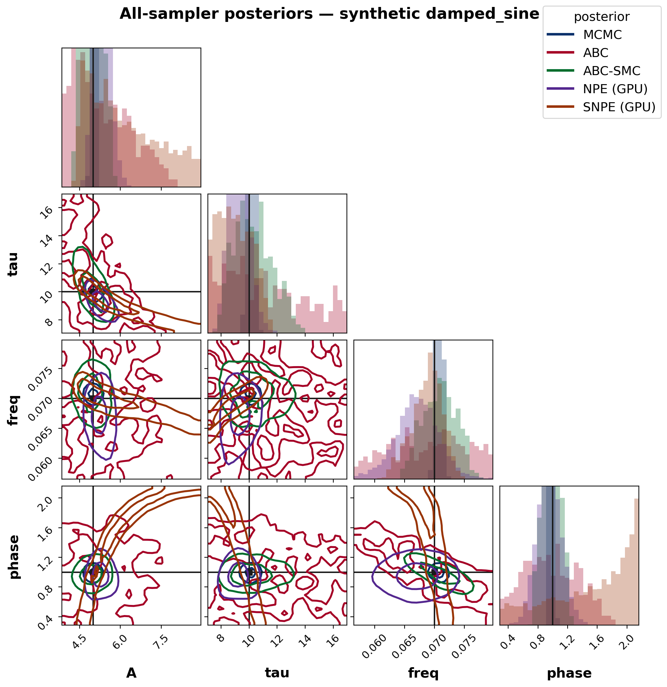
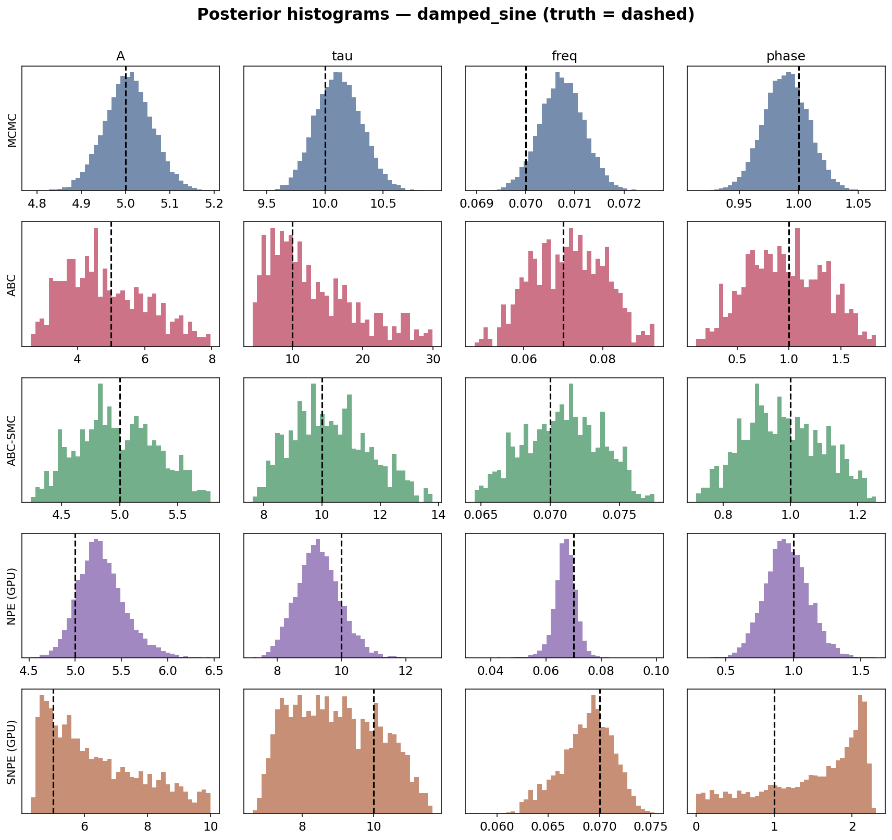
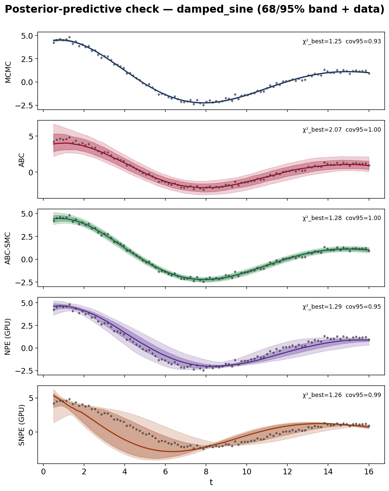
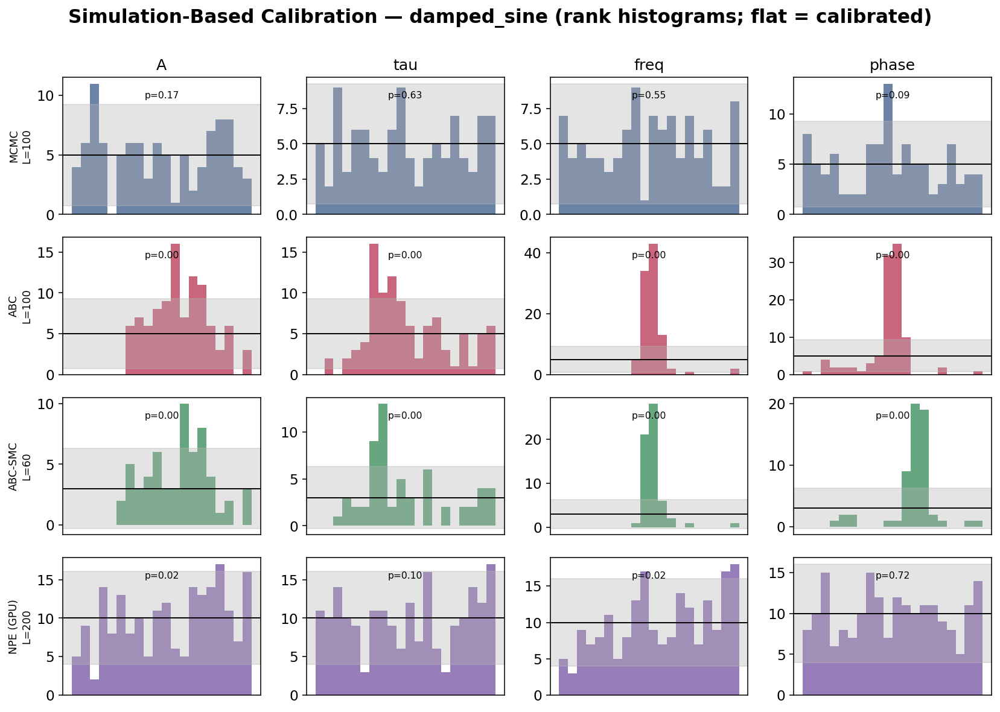
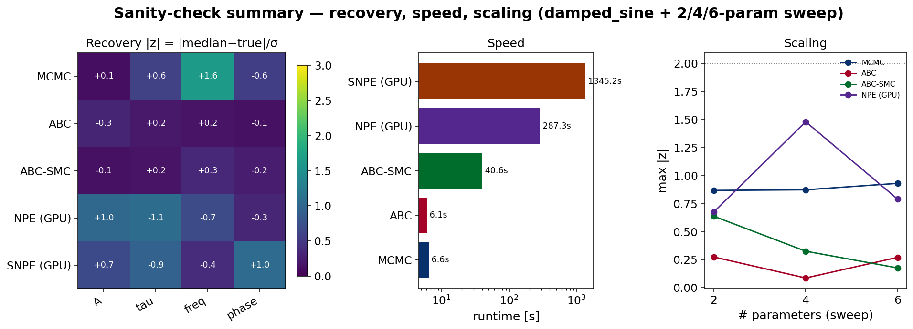

# WHISPER sanity check & benchmark — synthetic parameter recovery

Mock **damped_sine** `M = A·exp(−t/τ)·sin(2πf·t+φ)` (truth A=5, tau=10, freq=0.07, phase=1), white noise σ=0.15. Every sampler fits the *same* data.

## Recovery, goodness-of-fit & speed

| method | max\|z\| | cov68 | cov95 | χ²_best | PPC cov68 | PPC cov95 | runtime [s] |
|---|---|---|---|---|---|---|---|
| MCMC | 1.63 | 0.75 | 1.00 | 1.25 | 0.63 | 0.93 | 6.6 |
| ABC | 0.31 | 1.00 | 1.00 | 2.07 | 1.00 | 1.00 | 6.1 |
| ABC-SMC | 0.34 | 1.00 | 1.00 | 1.28 | 0.86 | 1.00 | 40.6 |
| NPE (GPU) | 1.06 | 0.50 | 1.00 | 1.29 | 0.61 | 0.95 | 287.3 |
| SNPE (GPU) | 1.04 | 1.00 | 1.00 | 1.26 | 0.83 | 0.99 | 1345.2 |

*max|z| = max over parameters of |median−true|/σ (≲2 ⇒ recovered). cov68/95 = fraction of parameters whose credible interval covers the truth. χ²_best≈1 ⇒ the model fits; PPC cov68/95 = fraction of data inside the noise-inflated predictive band (≈0.68/0.95 ⇒ calibrated). Single noise realization, so per-parameter coverage is coarse — SBC below is the calibration test over many realizations.*

## Simulation-Based Calibration (rank uniformity)

| method | L | min uniformity p | calibrated |
|---|---|---|---|
| MCMC | 100 | 0.091 | True |
| ABC | 100 | 0.000 | False |
| ABC-SMC | 60 | 0.000 | False |
| NPE (GPU) | 200 | 0.017 | False |

*Uniform ranks (p ≳ 0.05) ⇒ calibrated uncertainties; ∪-shape = overconfident, ∩-shape = underconfident.*

## Benchmark takeaways

- **Recovery:** every sampler recovers all parameters within ~2σ (best max|z| = ABC at 0.31); the medians agree with the injected truth.
- **Speed:** fastest → slowest is ABC (6s) < MCMC (7s) < ABC-SMC (41s) < NPE (GPU) (287s) < SNPE (GPU) (1345s).
- **Calibration (SBC), best → worst rank-uniformity p:** MCMC (0.091, calibrated), NPE (GPU) (0.017), ABC-SMC (0.000), ABC (0.000). Only p ≥ 0.05 is formally calibrated; the ordering shows how close each gets (exact MCMC leads; neural NPE is close; the likelihood-free ABC family trails).

### Statistical notes & fixes

- **ABC-SMC ε-floor.** A naive adaptive ε shrinks to χ²_min and collapses the posterior onto the MLE (spuriously overconfident: on the 2-param Gaussian pulse the raw run gave |z|≈8 with 0% coverage). WHISPER's `min_epsilon="auto"` floors ε at χ²_min + 2(k+2), reproducing the Gaussian posterior width — restoring |z|≲2 and nominal coverage on the single-realization recovery.
- **ABC is approximate — SBC proves it.** Over many realizations, rejection ABC is **under-confident** (finite acceptance tolerance ⇒ posterior wider than the truth, ∩-shaped ranks) and even ε-floored ABC-SMC does not perfectly calibrate on the **correlated** damped-sine target: its diagonal-Gaussian kernel cannot capture the freq–phase correlation (freq too wide, phase too narrow), so SBC still fails (p≪0.05). Point recovery is unbiased for both; only the *shape/width* of the uncertainty is off. This is exactly the likelihood-free approximation error SBC exists to reveal. The **exact MCMC** posterior is the calibrated one here; **NPE** is a close second (only mildly over-confident at this training budget — more simulations would close the gap).
- **Identifiable pulses.** A sum of Gaussians is invariant under permuting its (Aₖ,μₖ) pairs, so the sweep gives each μₖ a disjoint prior bin; otherwise every sampler is free to label-switch (a spurious multi-modal 'failure').
- **SNPE cost.** 10-round sequential SNPE is the most expensive method here by far; its amortized cousin NPE (1 round) trains once and is far cheaper. SBC over many realizations uses NPE's amortization (train once, rank many); re-training 10-round SNPE per realization is left out as prohibitive (its single-dataset recovery + PPC stand in).

## Dimensionality sweep (2/4/6 params, Gaussian pulses)

| method | 2p max\|z\| / t[s] | 4p max\|z\| / t[s] | 6p max\|z\| / t[s] |
|---|---|---|---|
| MCMC | 0.87 / 5.2 | 0.87 / 8.9 | 0.93 / 16.6 |
| ABC | 0.27 / 5.2 | 0.09 / 7.1 | 0.27 / 8.1 |
| ABC-SMC | 0.64 / 7.8 | 0.33 / 17.2 | 0.18 / 30.3 |
| NPE (GPU) | 0.68 / 91.2 | 1.48 / 95.0 | 0.79 / 117.9 |

*Cell = max|z| / runtime[s]. All methods stay within ~2σ as the parameter count grows 2→4→6; runtime scales gently. SNPE is omitted from the sweep (10-round cost); its recovery is shown on the damped-sine showcase above.*

